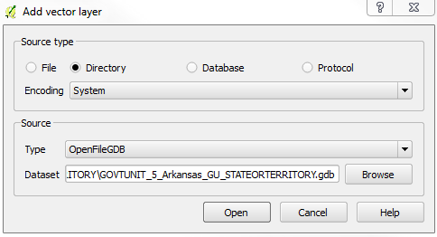
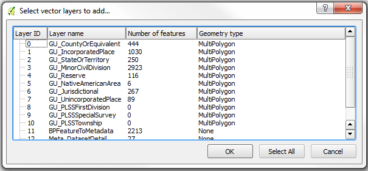
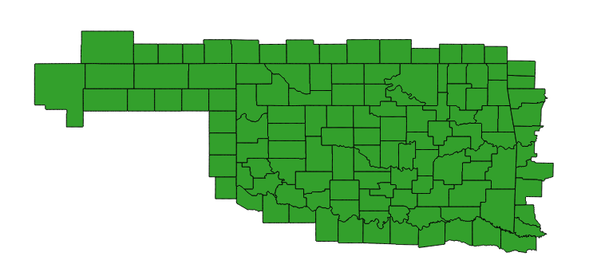

*Note: This material is available online with active hyperlinks at [https://github.com/mltConsEcol/TU_LandscapeAnalysis_Documents/blob/master/Assignments/AccessingGISData.md](https://github.com/mltConsEcol/TU_LandscapeAnalysis_Documents/blob/master/Assignments/AccessingGISData.md)

# Accessing Ecologically-relevant GIS Datasets

Though many studies use various spatial/GIS datasets, finding and working with them can be a bit of a mystery to a GIS newcomer. This document is designed to point users in the right direction to get started, with a focus on the United States (though some datasets discussed here are also available for other parts of the world). The resources listed below are not necessarily mutually-exclusive to one-another (i.e, you can often find some of the same datasets at multiple places), though some datasets may only be available from individual sources. Detailed instructions on downloading the data are given for the first source to familiarize users with data downloads, but they should explore the other websites to try and figure out how to access the data there - unfortunately every website is a bit different. Typically the projection information is provided and will be read by your GIS software, but if it is not, you may need to look into metadata that comes with the files. This document is meant to get users started, and is thus not to serve as a comprehensive manual for accessing every data source available. Remember - Google is your friend. If it helps, start at these websites to look for datasets you need; if you can't find them, they may exist, but that might require some web-searches. Also, internet Q&A outlets like [GIS Stack Exchange](http://gis.stackexchange.com/) are invaluable when you really get stuck.

## National-Scale Data

### The National Map

[The National Map](http://nationalmap.gov/) is kind of a one-stop-shopping location for lots of datasets that are distributed by the U.S. Government. These include vector layers of political boundaries, hydrologic data including stream networks and watershed boundaries from the [National Hydrography Dataset](http://nhd.usgs.gov/), and roads. These layers are typically available for download as shapefiles or geodatabase files. Raster datasets that are available include elevation (digital elevation models [DEMs]) from the [National Elevation Dataset](http://ned.usgs.gov/), land cover classifications from the [National Land Cover Database](http://www.mrlc.gov/), and aerial imagery.

To view what is available and download available datasets, use [The National Map Viewer](http://viewer.nationalmap.gov/viewer/) platform. Upon opening the webpage, you will see something similar to the image below. Browse  this page - hover your mouse over the icons just above the the map to see what they do, and expand the lists of layers on the left by clicking the + and - icons next to the categories. Check and un-check the boxes to see what these data look like; use the scroll-wheel on your mouse, or the magnifying glass with the + in it to adjust the zoom. You can also search for specific places in the search bar at the top. Note, for the layers labeled "... Availability", this will show polygons representing areas that the data are available for, as the layers themselves can be complex. However, when you go to download data, you will be able to download the actual layers.

\

#### Downloading Data from The National Map

\ To begin the process of downloading data from The National Map, simply click one of the "Download Data" icons, either at the top of the webpage, or just above the map window (in a row with other icons).   You do not need to have the layers you want to download visible on your map; you will select the layers in a later step.

You can select any of the appropriate options for defining the extent of data you wish to download. For beginners to GIS, the simplest ways are likely:

* draw and download by bounding box;
* download by current map extent; or
* download by coordinate input.
	
In this example, we'll focus on a natural area near our campus, Turkey Mountain. A search for "Turkey Mountain, Tulsa, OK" yields a fairly accurate result. Zoom to the appropriate area, and select the option to download data by drawing a bounding box (the first option).  Here's an image of the bounding box I have selected: 

\

After you draw the box, a new window will appear with check-boxes of data you want to download.  For now, lets check the options for "Boundaries" and "Elevation" and click "Next" (read the on-page instructions at this point if you are having issues).

A new window should now appear (image below), with lots of products available to download (right now you are only looking at the "Boundaries" products; you'll need to click the gray "Elevation" category to access those). Admittedly, this can be a bit overwhelming, and it might take a bit of trial and error to figure out what you need. In most contexts, for vector data,  shapefiles are the easiest to work with, but you might need to download a "File GDB" option instead. In this case, the third option, "USGS National Boundary Dataset (NBD) for Oklahoma 20140401 State or Territory Shapefile" might suffice, but if you want the fine-scale map of cities and towns, scroll down to that option as well. Check the box for both of those.  If data are available for multiple dates, but they otherwise look the same, get the most recent, or most appropriate for your focal time period.

\

Next, open the tab for "Elevation" - again, there are lots of options. Notice that in the product name, it typically says "1 arc-second",  "1/3 arc-second" or "100 [or 200]-Meter Resolution" - this identifies the resolution (i.e., grain size), as these are raster layers. 1 arc-second is ~30 meters x 30 meters and 1/3 arc-second is ~10 meters x 10 meters. You'll notice there are also a number of formats available. GeoTIFF or IMG files are typically among the easiest to open, with the projection information embedded and nothing to do but import those in QGIS.  If you are working with a large area, you'll have to take notice of the location these are from - in the name, the n37w096 indicates the latitude/longitude of the upper left corner of the individual tile. For large areas, it will have multiple tiles with different latitude/longitude designations, and you'll need to download all that cover your study area. In this case, we'll select the "USGS NED n37w096 1 arc-second 2013 1 x 1 degree IMG".

After you select all desired layers, click the "Next" button. (In your own work, select whatever layers you might need.)

On the left hand side of the screen, ad new panel should be displayed, the "Cart" - you can click on the products you previously selected, and a preview will appear; you can also remove layers, or opt to add more. If you are satisfied with the selection, click "Checkout" to move on with your data order. You'll need to enter your e-mail address twice, and click the "Place Order" button.  You'll receive download links in your e-mail, though it can take a little while. The links typically don't work in Mozilla Firefox, but work to start downloads in Internet Explorer or Google Chrome.

Once you have the data downloaded, you can import them into your favorite GIS software.

### USDA GIS Resources

The [USDA Geospatial Gateway](http://datagateway.nrcs.usda.gov/) also has a wide variety of data available for download, including soil data, and high resolution aerial imagery. To get started, go to the [website](http://datagateway.nrcs.usda.gov/) and click the green "Get Data" button (towards the upper-right). 

\ 

From there, you'll need to select the desired State/County of interest, and the datasets you need. see the panes on the left of the screen that describe each step, as in the example below). Note, this website has available Climate data from PRISM, further described below.

\

## State GIS Resources (for Oklahoma)

Most states have their own repositories for GIS data. Typically when I'm trying to find such a repository, I do a Google search for something along the lines of these phrases: "[Insert State Name] GIS Data"; "[Insert State Name] GIS Repository"; "[Insert State Name] GIS Warehouse"; or "[Insert State Name] GIS Clearinghouse". Here are also a couple of websites that list some resources available by state:

* [Tulsa City-County Library GIS resources](http://guides.tulsalibrary.org/content.php?pid=557423&sid=4599537)
* [Carleton College webpage from theNational Association of Geoscience Teachers](http://serc.carleton.edu/NAGTWorkshops/gis/state_resources.html)

For Oklahoma, a couple of particular websites that can be useful are:

* [The OKMaps Website](http://ogi.state.ok.us/ogi/search.aspx)
* [Center for Spatial Analysis at the University of Oklahoma](http://geo.ou.edu/DataFrame.htm)

## Climate Data

Climate data are typically recorded at individual weather stations, though in ecological studies, it is typically useful to have summaries of climate conditions for entire landscapes, describing characteristics of temperature and precipitation regimes. Thus, multiple organizations have interpolated the data from weather stations, to estimate conditions for large areas. There are two main sources I frequently go to, listed below. Browse the respective website for information on downloading the data. If you need information from a specific weather station, you can search the resources from the [NOAA National Climatic Data Center](http://www.ncdc.noaa.gov/data-access/land-based-station-data). Other sources may be available from state-wide monitoring networks (e.g., [Mesonet for Oklahoma](https://www.mesonet.org/) and other organizations.

* [PRISM Climate Group at Oregon State](http://www.prism.oregonstate.edu/)
	* Has 800 meter pixel data for the continental United States
	* Lots of information, including 30 year normals for monthly and annual precipitation, maximum temperature, and minimum temperature.
	* Also has elevation layers, historical data, and recent data for individual months
* [WorldClim Global Climate Data](http://www.worldclim.org/) 
	* Global Dataset of 30 second resolution (~800-1,000 meter resolution); Coarser resolutions are available (which are smaller file size)
	* Monthly and annual minimum, maximum, and mean temperature and precipitation
	* Also contains "Bioclim" layers - described [here](http://www.worldclim.org/bioclim)
		* These layers are derived from monthly precipitation and temperature data, to describe the climate in biologically meaningful ways.
	* Datasets include current conditions (based on 50 year average), projected future conditions under various climate change scenarios, and historical conditions.

	
## Some Notes About Working Downloaded Data

### Uncompressing Data

GIS datasets tend to  be fairly large, thus they often come in compressed formats. For files compressed into a '.zip' file, you can simply use the utility that came with your operating system (in Windows, you could just right-click on the .zip file, and select "Extract All".

Another compressed format you may encounter is or 'tar.gz', for which special software is generally required. [7zip](http://www.7-zip.org/) is a free, powerful tool for dealing with compressed files in Windows. If you check out the [download](http://www.7-zip.org/download.html) page, there are some options listed for Mac and Linux systems (scroll to the bottom). For Windows machines, simply download and run the appropriate installer (32 bit or 64 bit, depending on your system; version 9.20 is the current standard version.

After installing 7-zip, you should see options to work with files in 7-zip when you right-click on them (as shown below; if not, you can find 7-zip in your programs, open the software, browse to your appropriate .tar.gz file, and use the extract functions as described hereafter).  In the example below, the compressed file is 'builtupp_usa.shp_nt00899.tar.gz', and we start by extracting it to a the current directory.

\

The resulting file will end in '.tar' Now you need to do one more de-compression step - right click on the .tar file, select 7-zip, and 'Extract to "[Filename]"'. This should create a new folder, with all of the files that were in the compressed folder.

### Dealing with ESRI Geodatabases in QGIS (tested with version 2.6.1)

Some GIS data are only available in a format developed by the company that makes ArcGIS (ESRI), called ESRI Geodatabases (ESRI .GDB files). Typically they are used for vector datasets. There are some extra steps in importing these into QGIS:

* \  Click on the "Add Vector Layer" icon.

* In the window that pops up, choose the source-type as "Directory", leave the Encoding set to the default, and change the source to "OpenFileGDB" (see the example window below).

* Then, click "Browse",  find and select folder ending in '.gdb', where the data are stored (in the example given here, it is the state boundary dataset for Arkansas, downloaded from The National Map), and click "Open".

\

* Another window will now appear, with a list of layers in this geodatabase. You can look at the "Geometry Type" to identify whether the layer is composed of lines, polygons, or points. If no geometry type is identified, the layer may be a table or metadata. You can use "Select All" to load all layers - this may be a lot of information though, so if there are a lot of layers and a large area, you can look at one layer at a time.

\

* You cannot edit these layers while they are in .gdb files, but you can export them to Shapefiles, and conduct any manipulations/analyses with that format.
	* Right click on the layer you need to work with in the Layers Pane of QGIS, and selct "Save As".
	* Keep the Format as ESRI Shapefile and define a filename and location in the "Save As" box. The defaults should work for most purposes. The defaults should load the new Shapefile into your current project, but you can also use standard data import methods to bring the data into QGIS.
	

### Removing Unwanted Features from Vector Layers (e.g., isolating a single county of interest)

Vector datasets may be available for larger areas than you really want - for example, if you want to work with Tulsa County, Oklahoma, and you download the appropriate layer from The National Map, the layer you have will likely include all counties of Oklahoma (and adjacent counties in neighboring states).

\

One way, described below, is to do a query on (i.e., filter out) the layer to show only the desired features, based on the Attribute Table. Alternatively, you may make a copy of the shapefile, use the layer editing tools to delete features. Here are instructions for the former option, with an example from the "County or Equivalent" layer for Oklahoma, to only display Tulsa County:

* Right-click the focal layer and select "Properties"
* Along the left side of the Properties window, select the "General" tab.
* Make sure the "Feature subset" section is open by clicking the arrow next to that text, and click the "Query Builder" button (see screen-shot below).

\

* In the next window that appears, there will be an area that says "Fields" - these are the columns in the Attribute Table for the layer. The field "County_NAM" contains the full names of counties. An example of the window filled as necessary is provided after this section.
	* If you click a field name, and in the Values box click either "Sample" or "All", either a random sample or all of the possible values for the selected attribute will be displayed. So, if you select "COUNTY_NAM" and then click "All", you will see all of the county names listed.
* Double-click the name of the field you wish to filter the data by, and it will appear in the white box towards the bottom of this window.  Then select the appropriate operator you wish to use. 
	* In this case, we wish to select only Counties where the "COUNTY_NAM" is "Tulsa", so choose the "=" button. If you wanted all counties except for Tulsa, you would use the "!=" button.
	* Then type " 'Tulsa' " (or double-click on "Tulsa" in list of Values).
* If you click "Test" with these settings, it should tell you "The where clause returned 1 row(s).", meaning that only one feature in the dataset will be used (i.e., Tulsa County).
* Click "OK", then Click "OK" again in the Properties window, and now Tulsa County is the only area displayed.
* If you need to un-do this, simply get back into the Query Builder window, and use the "Clear" button towards the bottom.

\

	
And here's what the result should look like:

\
 

### Spatial Reference Information for GIS Data Layers

When you load data into a GIS program, the projection information should automatically be interpreted by the software, if it is stored correctly with the relevant files. If the projection information is non-existent, you may need to look through metadata files that come with the data (often stored in '.xml' or '.html' documents, labelled as 'metadata'). If you find the projection and need to set it in your GIS software, it may be easiest to do so by filtering for specific terms you find in the metadata. Furthermore, an internet search for the information you find in the metadata, with "EPSG" code in the search phrase can help you find a code used in GIS, the EPSG Code. For example, a Google search for 'wgs 84 epsg' returns [this webpage](http://spatialreference.org/ref/epsg/wgs-84/) as the first result, and indicates the EPSG code for projected (i.e., global coordinates of lat/long) in the datum WGS 84 is 4326.

