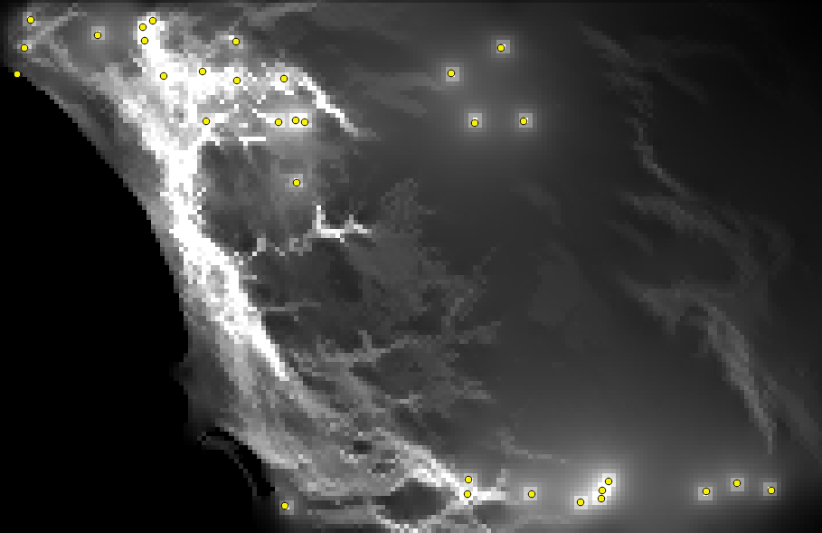

*This document, with active hyperlinks, is available online at:[https://github.com/mltConsEcol/TU_LandscapeAnalysis_Documents/blob/master/Assignments/Lab10_LandscapeConnectivity.Rmd](https://github.com/mltConsEcol/TU_LandscapeAnalysis_Documents/blob/master/Assignments/Lab10_LandscapeConnectivity.Rmd)*

**Due Date: Thursday,  21 April 2015**

***PLEASE WRITE YOUR NAME ON YOUR ANSWER DOCUMENT***

#Questions

1) Give an example of when you might use a graph theory approach to analyze landscape connectivity. For what types of species would this approach be most relevant?

2) Look at the output from Circuitscape (see below). Circle or highlight the locations that appear most isolated.

3) 

4) 

5) 

    a) 
    b) 

6) 

7) 

8) 

9) 

    a) 
    b) 

10)  

\

