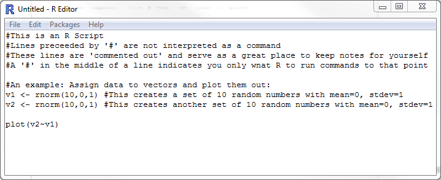

*This document, with active hyperlinks, is available online at: [https://github.com/mltConsEcol/TU_LandscapeAnalysis_Documents/blob/master/Assignments/Lab3_Import_Regress_RipleysK.Rmd](https://github.com/mltConsEcol/TU_LandscapeAnalysis_Documents/blob/master/Assignments/Lab3_Import_Regress_RipleysK.Rmd)*


**Due Date: Thursday, 5 February 2015**

**This assignment is worth 20 Points, with 2 points per question.**

# Scripts in R

In the first lab involving R, we simply used the command line, or Console as an interactive interface. As you observed, you can carry out the basic functions quickly and easily, though saving your commands and making your work repeatable might be difficult. Most simply, it seems you could copy and paste all of your commands into plain text editor (e.g., Notepad and Text Edit are built-in editors on Windows and Macs, respectively).But isn't there a better way?!?! 

**YES!!!** R has a built-in tool for this, "scripts". Scripts are sets of code that you can re-run as you desire from a static file, either a line at a time, or all-at-once. 

To create a new script in R, use the File menu at the top of your R window, and select "New Script". A new window will appear within R (in the following image); you can type your commands here, and use [CTRL]+R (Windows) or [Command]+[Enter] (Macs) to run an individual line where your cursor is, or all lines that you have selected with your mouse.  You can save this file as a '.R' file, which you can open up from within R, or work with it using a text editor.  


\


You can include "comments" in script files, which R will not interpret as code. To designate a comment, simply use a '#' before the text, as shown above. You can do this for an entire line or for part of a line, following actual R code, as seen below. Everything that you run from the Script will be displayed in the interactive terminal window as it goes. (Try copying the code displayed in the preceeding image, and run it from a own script window).


# Importing Data

Now that you have this great tool (scripts) at your fingertips to make your work repeatable, lets try to do some more complex steps, which are normal parts of working with data in R. We'll work with a dataset from tree censusus, conducted at Harvard Forest ([http://harvardforest.fas.harvard.edu/](http://harvardforest.fas.harvard.edu/). We'll work with a '.csv' file, which stands for "Comma Separated Values" - this is among the easiest of formats to import into R. If you have data you wish to work with in R but it is currently stored in Excel, you can easily export it to a .csv file using the "Save As" option, and choosing '.csv' as the file type.

I generally suggest manipulating your data in R, as you will do in exercise. If you save the script, from the data import through outputting final results, you can remember exactly what you did, and fix any mistakes you find that you made. You cannot easily do this in a spreadsheet, where it may be easy to accidentally mess-up your data (e.g., switch row order of only 1 column).

Download the Lyford Mapped Tree Plot Data from Harvard Forest, available here: [http://harvardforest.fas.harvard.edu:8080/exist/xquery/data.xq?id=hf032](http://harvardforest.fas.harvard.edu:8080/exist/xquery/data.xq?id=hf032). Under the "Data" section of the website, towards the top, there are two links: the first, ([hf032-02](http://harvardforest.fas.harvard.edu/data/p03/hf032/hf032-02-tree.csv)) is the data - simply click to initiate the download; The second ([hf032-01](http://harvardforest.fas.harvard.edu/data/p03/hf032/hf032-01-map.jpg)) is a map of plots in which data were collected. Save the dataset to a logical place that you can navigate to on your computer. If the data automatically open in Microsoft Excel, simply save it in the same format it came as (.csv). (It can be useful to browse the data in Excel, but we'll do all analysis and manipulation in R.)

\

The citation for this dataset is: *Foster D, Barker Plotkin A, Lyford W. 1999. Lyford Mapped Tree Plot at Harvard Forest since 1969. Harvard Forest Data Archive: HF032.*

You should browse this website for information about how the data were collected - in particular, look at the Detailed Metadata section. This will explain what each column in the dataset refers to, and provides a key to the abbreviations (notably different tree species) in the dataset. *This will be handy later in the assignment*

When you are working in R, it is generally a good idea to specify the folder location where you want R to be reading data from/writing data to. If you don't do this, you may have to specify the full path for reading and writing files, rather than just the file names.  The active folder that R is looking at is called the "working directory".  R has a default working directory, but that is not usually where you keep your data stored. To find out the current working directory, use:

```{r, results='hide'}
getwd()
```

To change it to the folder where you have your data stored you will use the "setwd" function, and the only argument that you need to include is the desired file path in quotation marks (either double or single quotes, as long as you are consistent, will both work. For example, I want to set my working directory to "My Documents" on my computer.

```{r, results='hide'}
setwd("D:/TregliaFiles/Documents")
```

To get the folder path, you can simply browse the folder manager on your computer (e.g., My Computer/Windows Explorer on Windows), find where you have the data,  copy the path at the top of the window, and paste it into your script window in R. 
*If you are a Windows user, you will have to make a small edit: you need to change the backslashes ('\') in  the file path to forward slashes ('/') or double backslashes ('\\') for your path to be read correctly.*

To actually read these data into R, you will use the 'read.csv' function, with the only argument as the file name for the dataset you've saved. This is a specific form of a function 'read.table', which can import various types of text files, but 'read.csv' is set to use .csv files by default. For different datasets you may need to use different arguments, found in the Help for 'read.csv'. We will assign the imported data to a logical name - maybe 'HTrees'. If I am doing this in a script window, you should have something similar to the following image.


```{r, include=FALSE}
HTrees <- read.csv("http://harvardforest.fas.harvard.edu/data/p03/hf032/hf032-02-tree.csv")
```

\


At this point, you can inspect the dataset structure, and quickly look at the first and last few lines to get a feel for what it looks like.


### Question 1: How many different types of tree species are listed in this dataset? (I want you to figure this out in R, and for full credit you must indicate what function you used). 


# Subsetting Data

*The following website may aid in the next few steps: [http://www.ats.ucla.edu/stat/r/modules/subsetting.htm](http://www.ats.ucla.edu/stat/r/modules/subsetting.htm)*


This dataset is large, with many different species in a variety of plots from many years. We will only focus on the plot "SE11", and the species *Acer rubrum* and *Quercus alba*, from the year 1991. 

### Question 2: take a subset of the data so you have a dataset with the properties just described. To show that you've done, simply provide the commands you used. You can do this in one or multiple steps. For consistency with the rest of this exercise document, assign the subsetted dataset the name 'HTreesSub'

```{r, include=FALSE}
HTreesSub <- subset(HTrees, block=="SE11" & meas3yr==1991 & species=="ACRU"|block=="SE11" & meas3yr==1991 & species=="QUAL")
```

If you look at the structure of this dataset, you will notice that the number of levels listed for factors is the same as for the original dataset. You can clean this up a bit using the 'droplevels' function:

```{r, results='hide'}
HTreesSub <- droplevels(HTreesSub)
```

Given that our focal year is 1991, and a lot of the columns in the dataset have information about other years, we can discard those columns. There are a few ways to do this, but here we'll use a "column index" method. In R, every row and column has an numerical index (row i, column j), starting at 0. We can specifically call on these in functions and we refer to indices in R using 'datasetName[rowNumber,columnNumber]'. For example, if you want to see what is in the 2nd row and 3rd column of your subsetted dataset, you can use 

```{r, results='hide'}
HTreesSub[2,3]
```

To quickly identify which column corresponds to which index number, you can use the function 'names'

```{r}
names(HTreesSub)
```

Then, use indices to define a dataset with only the columms you want. In this case We will the following variables:

  * treeid
  * xsite
  * ysite
  * species
  * dbh91
  
### Question 3: Create another subset of the data with only the variables listed above, from HTreesSub. Name this new subset "HTreesSub91"; provide the code you used to do this.

```{r, include=FALSE}
HTreesSub91 <- HTreesSub[,c(3:6,13)]
```

# Linear Regression

In class we discussed linear regression; lets give this a try in R. Perhaps we hypothesize that for some reason, there is a significant effect of x-position (on a cartesian plane) on the diameter at breast height of the trees. Perhaps we are aware of a historic gradient of farming in this area, which has a lasting effect on trees that would cause this. We can test for the presence of such a relationship using a linear regression. Note this is a very basic example with a relatively simple method, but should familiarize you with the way model equations work in R.

It can be helpful to plot the data in advance and visually inspect the data.

### Question 4: Plot the diameter of trees along the y-axis and the x-position of trees along the x-axis; paste the result into a document with your answers.

```{r, include=FALSE}
plot(HTreesSub91$xsite,HTreesSub91$dbh91)
```

The function for a simple linear regression is 'lm' (i.e.,linear model). In functions like this, we need to define an equation, just as in a regular regression equation. The function, for a simple case like this, is structured as 'dependentVariable~independentVariable'. We can also specify our dataset in a separate argument of the function. Thus, in our case, we would use:

```{r, results='hide'}
dbhXpos <- lm(dbh91~xsite, data=HTreesSub91)
```

The above command creates an object called 'dbhXpos' that contains all of the information from the regression. Note that there were some missing values for dbh91 in this dataset - the default way of dealing with these observations is simply to ignore those rows of data. 

To inspect everything stored in the regression object, simply look at the structure as you would any other object. It looks complex - you can take time and try to interpret it, but we'll use the 'summary' command to get some useful information.

```{r, results='hide'}
summary(dbhXpos)
```

You can see the F-statistic, and the p-value at the bottom of this output. Additinally, there is an output of 'r-squared', which is the proportion of variance in the dataset explained by the regression (calculated as Regression Sum of Squares / Total Sum of Squares)

Using the plot function on the lm object (i.e, 'plot(dbhXpos)') will produce some diagnostic plots for inspecting the residuals, which can be useful in examining whether the data actually meet assumptions of the test.

If you want to view the regression line on the plotted data, plot the data as for Question 4. Then, immeiately after, use (without the '#'):

```{r, eval=FALSE}
 abline(dbhXpos)
```

If you want to adjust the appearance of line, look into the arguments 'lwd' and 'lty'. Check the help/google around for more informatino about 'abline'.

# Ripley's K Analyses

## R packages

Though R has great functionality on it's own, a major strength of the software is the ability of others to write and contribute packages. There are packages for a huge range of analyses, well beyond ecological applications. Some packages come with R, such as 'MASS' and 'lattice' and others have to be installed. 

To see if a package is already installed, you can simply try to open it using the 'library' function. For example, 

```{r, include=FALSE}
library(spatstat)
library(maptools)
```

```{r, results='hide'}
library(sp)
```

If a package is not installed, R will indicate that in the console that it is not available. If the package is available and opens, R will typically indicate what version of the package it is, and sometimes include other details.

If a package you need is not installed, use the 'install.packages' function:

```{r, eval=FALSE}
install.packages("spatstat")
```

When using this command, R will ask you to specify what repository or mirror to use. These are essentially servers around the world, at various institutions, with all of the R materials available for download. Typically it makes sense to pick one from nearby for the quickest download times - in Tulsa I usually chose a repository in Kansas or Texas as adjacent states. 

Sometimes packages call on functions from other functions - this is called dependency; when you install one package, R will typically install other packages necessary for the specified packages to work. Check out the help for 'install.packages' for more details.

If the 'spatstat' package is already installed, try 'maptools' or 'vegan', two other useful packages.

In these next steps, you will use the following packages:
  
  * spatstat
  * sp
  * maptools
  
Make sure they are all installed and loaded.

Each packages has a website hosted by [CRAN (Comprehsnsive R Archive Network)](http://cran.r-project.org/), with at least basic documentation of commands. Some packages also have 'vignettes', which go into detail on accomplishing some particular tasks. For example, the site for spatstat is [http://cran.r-project.org/web/packages/spatstat/index.html](http://cran.r-project.org/web/packages/spatstat/index.html).

## Converting the Data into Spatial Objects

As the data are now, it is simply a 'dataframe', or a table with multiple types of data in different columns (some columnhs have numeric data, while some have factor data). Though we know from the metadata that the xsite and ysite variables have refer to coordinates within the sampling plots, R has no way of knowing this is the case - to R, they are simply another set of variables. For some analyses this is okay, but for others, the data need to be defined as a spatial dataset. We can simply do this as follows for points with x/y coordinates: 

```{r, results='hide'}
coordinates(HTreesSub91) <- c('xsite', 'ysite')
```

### Question 5: After the above step, what class of object is 'HTreesSub91'?

We have not specified a coordinate reference system. However, there is none for these data - they are projected according to a simple cartesion coordinate system in the study plots. If the data were in a standard coordinate system and we wanted to include them in a map, this would be necessary and we will cover this later in the semester. 

## Plotting Spatial Data
As with simple linear regressions, it is often informative to view our data as we analyze it. The 'plot' function is actually very broad, and its use varies with the type of object you are working with. You can view all the trees in the focal plot in a simple graphic with: 
plot(HTreesSub91)

### Question 6: Building on what you've learned, with a simple plotting function and data subsets, plot *Acer rubrum* and *Quercus alba* on the same figure in different symbols. You may need to use two commands, and the arguments 'pch' and 'col'. Here's a hint: look into the function 'points'. You may need to browse resources referenced in the Lab 2 handout on Getting Familiar with R. Don't worry about making a legend, but you should be able to keep track of which points represent which tree species for yourself. The result should may look something like what is depicted below; copy and paste the figure into a results document and provide your code for the plot:

```{r, echo=FALSE}
plot(subset(HTreesSub91, species=="ACRU"))
points(subset(HTreesSub91, species=="QUAL"), col="blue", pch=2)
```

It is definitely possible to make nicer-looking maps in R, but for now, something simple as shown above is sufficient.

### Question 7: Based on inspection of your previous figure, do you suspect that one species exhibits a significant spatial pattern at certain scales? If so, which species, what pattern (clustered or disperesed), and at what scale (small/local or broad/landscape)?

## Ripley's K Analyses

Though plotting the arrangement of the two focal tree species might help us guess which trees are clumped or dispersed at different scales, we need to use statistically inference in order to draw strong conclusions. As we covered in lecture, Ripley's K analysis is perfect for this.

We will first adjust the dataset to only include the positional information (now stored as a separate entity within the object), and the tree species.

```{r, results='hide'}
RipleyTrees <- HTreesSub91[,2]
```

Lets first look at each tree species separately to identify whether individual trees of a single species tend to be clustered or dispersed with respect to one another. We will create two subsets - one for each species.

```{r, results='hide'}
acru <- subset(RipleyTrees, species=="ACRU") #Acer rubrum subset
qual <- subset(RipleyTrees, species=="QUAL") #Quercus alba subset
```
Now we need to turn each of these into 'point pattern' objects. To learn more about this class of objects, you can use use help(ppp).

```{r, results='hide'}
acru.ppp <- as(acru, "ppp")
qual.ppp <- as(qual, "ppp")
```

Ripley's K is computed using the function 'Kest' in the spatstat package. We can simply run the function on each of the two tree species and plot the results within a single line of code. We want to use some sort of edge correction as we discussed in class - the help file for Kest has some explanation and citations for a number of different options. The 'best' option should generally be appropriate. In your interpretation, remember that the observed K function indicates clustering when it is above the theoretical curve, and segregation when it is below the theoretical curve. The theoretical curve may be labeled 'Ktheo' or 'Kpois' in the output.

```{r, eval=FALSE}
plot(Kest(acru.ppp, correction="best"))
plot(Kest(qual.ppp, correction="best"))
```

We can also achieve the same thing by assigning the 'Kest' part of the above code to an object, and then plotting it. For example, with *Acer rubrum*:

```{r}
K.acru <- Kest(acru.ppp, correction="best")
plot(K.acru, main="Ripley's K function for Acer rubrum")
```

### Question 8: Describe how the individuals of each tree species are clustered, dispersed, or random across a range of scales. In addition, plot the K functions computed no edge correction - how would your interpretation of the results change for each species? You don't need to show the final plots, but rather describe the differences you notice.


To determine the significance of the patterns in K functions, it is useful to use simulations or randomizations of the data to attain confidence intervals for complete spatial randomness. We can use the 'envelope' function for this - the gray area will represent the 95% confidence intervals for complete spatial randomness based on these simulations of data.

```{r, results='hide', eval=FALSE}
plot(envelope(acru.ppp, Kest, correction="best", nsim = 100)) #100 simulations
plot(envelope(qual.ppp, Kest, correction="best", nsim = 100)) #100 simulations
```

For *Quercus alba* your output figure and in the R console should be something like this:

```{r, include=FALSE}
e <- envelope(qual.ppp, Kest, correction="best", nsim = 100) #100 simulations
```

```{r, echo=FALSE, message=FALSE, error=FALSE}
plot(e, main = "Ripley's K for Quercus alba with 95% Confidence Intervals of CSR")
```


### Question 9: Create the envelopes with 1000 simulations and explain how this increase in simulations appears to affect the confidence intervals.

The following code produces Ripley's K output for both species together- it shows whether individuals of one species tend to cluster near trees of another species. Again, higher positive values of Kest indicate clustering, and lower negative values indicate segregation among events, this time by type (i.e, tree species).


```{r, eval=FALSE}
RipleyTrees.ppp <- as(RipleyTrees,"ppp")
plot(envelope(RipleyTrees.ppp, Kcross, i="ACRU", j="QUAL",nsim=100))
```

### Question 10: Does there appear to be a relationship between the two tree species in this focal plot? Or do they follow Complete Spatial Randomness? If there is a signficant pattern at any scale, describe it. 