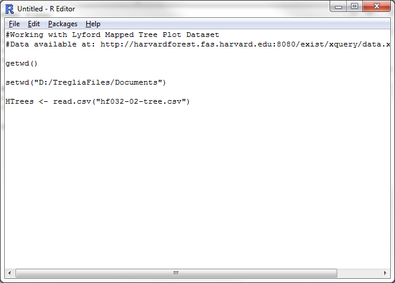

*This document, with active hyperlinks, is available online at: [https://github.com/mltConsEcol/TU_LandscapeAnalysis_Documents/blob/master/Assignments/Lab3_MoreIntroToR.Rmd](https://github.com/mltConsEcol/TU_LandscapeAnalysis_Documents/blob/master/Assignments/Lab3_MoreIntroToR.Rmd)*

In the first lab using R, we simply used the command line as an interactive interface. You can carry out the basic functions quickly and easily, though saving your commands and making your work repeatable might be difficult. Most simply, it seems you could copy and paste all of your commands into plain text editor (e.g., Notepad and Text Edit are built-in editors on Windows and Macs, respectively), although this is still cumbersome. Isn't there a better way?!?!

**YES!!!** The key to this is "scripts" - these are sets of code that you type, and can re-run as you desire, either a line at a time, or all-at-once. To create a new script in R, use the File menu at the top of your R window, and select "New Script".

A new window will appear within R; you can type your commands here, and use [CTRL]+R to run an individual line where your cursor is, or all lines that you have selected with your mouse. You can also run all of the code at once, by using the "Edit" menu, and selecting "Run All".  You can save this file as a '.R' file, which you can open up from within R, or edit using a plain text editor of your choice.  A helpful aspect of this is you can include "comments" in script files, which R will not run as code. To indicate a comment, simply use a '#' before the text. You can do this for an entire line, or for part of a line, after actual R code, as seen below. At this point, everything that you run from the Script will be displayed in the interactive terminal window. (Try copying the code displayed in the image, and run it from your own script window).

\

Now that you have this great tool at your fingertips to make your work repeatable, lets try to do some more complex steps, which are normal parts of working with your data in R. We'll work with a dataset from tree censusus, conducted at Harvard Forest ([http://harvardforest.fas.harvard.edu/](http://harvardforest.fas.harvard.edu/). We'll work with a '.csv' file, which stands for "Comma Separated Values" - this is among the easiest of formats to import into R. If your own data that you want to work with is stored in Excel, you can easily export it to a .csv file using the "Save As" option, and choosing '.csv' as the file type.

Download the Lyford Mapped Tree Plot Data from Harvard Forest, available here: [http://harvardforest.fas.harvard.edu:8080/exist/xquery/data.xq?id=hf032](http://harvardforest.fas.harvard.edu:8080/exist/xquery/data.xq?id=hf032). Under the "Data" section of the website, there are two items: the first, ([hf032-02](http://harvardforest.fas.harvard.edu/data/p03/hf032/hf032-02-tree.csv)) is the data - simply click to initiate the download; The second ([hf032-01](http://harvardforest.fas.harvard.edu/data/p03/hf032/hf032-01-map.jpg)) is a map of plots in which data were collected. Save the dataset to a logical place that you can navigate to on your computer. If the data automatically open in Microsoft Excel, simply save it in the same format it came as (.csv). (It can be useful to browse the data in Excel, but we'll do all analysis and manipulation in R.)
*The citation for this dataset is: Foster D, Barker Plotkin A, Lyford W. 1999. Lyford Mapped Tree Plot at Harvard Forest since 1969. Harvard Forest Data Archive: HF032.*

You should browse the website with the data for information about how it was collected - in particular, look at the Detailed Metadata. This will explain what each column in the dataset refers to, and provides a key to the abbreviations (notably different tree species) in the dataset.

When you are working in R, it is generally a good idea to specify the folder location where you want R to be reading data from/writing data to. This location is the "working directory".  R has a default working directory, but that is not usually where you keep your data stored. To find out the current working directory, use

```{r, results='hide'}
getwd()
```

To change it to the folder where you have your data stored you will use the "setwd" function, and the only argument that you need to include is the desired file path in quotation marks (either double or single quotes, as long as you are consistent, will both work. For example, I want to set my working directory to "My Documents" on my computer.

```{r, results='hide'}
setwd("D:/TregliaFiles/Documents")
```

To get the folder path, you can simply browse the folder manager on your computer (e.g., My Computer/Windows Explorer on Windows), find where you have the data,  copy the path at the top of the window, and paste it into your script window in R. 
*If you are a Windows user, you will have to make a small edit: you need to change the backslashes ('\') in  the file path to forward slashes ('/') or double backslashes ('\\') for your path to be read correctly.*

To actually read the data into R, you will use the 'read.csv' function, with the only argument as the file name for the dataset you've saved. This is a specific form of a function 'read.table', which can import various types of text files, but 'read.csv' is set to use .csv files by default. We will assign the data to a logical name - maybe 'HTrees'. If I am doing this in a script window, you should have something similar to the following image.


```{r, include=FALSE}
HTrees <- read.csv("http://harvardforest.fas.harvard.edu/data/p03/hf032/hf032-02-tree.csv")
```

\


At this point, you can inspect the dataset structure, and quickly look at the first and last few lines to get a feel for what it looks like.


### Question 1: How many different types of tree species are listed in this dataset? (I want you to figure this out in R, and for full credit you must indicate what function you used). 

*The following website may aid in the above question and the next few steps: [http://www.ats.ucla.edu/stat/r/modules/subsetting.htm](http://www.ats.ucla.edu/stat/r/modules/subsetting.htm)*


This dataset is large, with many different species in a variety of plots across many years. We will only focus on the plot "SE11", and the species *Acer rubrum* and *Quercus alba*, from the year 1991. 

### Question 2: take a subset of the data so you have a dataset with the properties just described. To show that you've done it, simply provide the commands you used. You can do this in one or multiple steps. For consistency with this document, assign the subsetted dataset the name 'lab3Subset'

```{r, include=FALSE}
lab3subset <- subset(HTrees, block=="SE11" & meas3yr==1991 & species=="ACRU"|species=="QUAL")
```

You can remove extraneous factor levels (e.g, other tree species, )

Given that the our focal year is 1991, and a lot of the columns in the dataset have information about other years, we can discard those columns. There are a few ways to do this, but here we'll use a "column index" method. In R, every row and column has an numerical index (row i, column j), starting at 0. We can specifically call on these in functions and we refer to indices in R using 'datasetName[rowNumber,columnNumber]'. For example, if you want to see what is in the 2nd row and 3rd column of your subsetted dataset, you can use 

```{r, results='hide'}
lab3subset[2,3]
```


