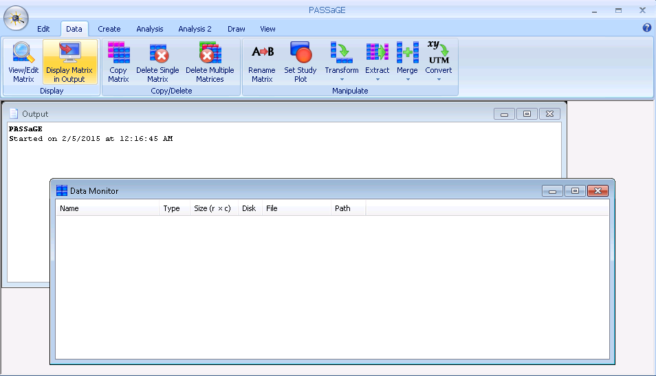
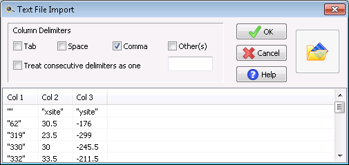
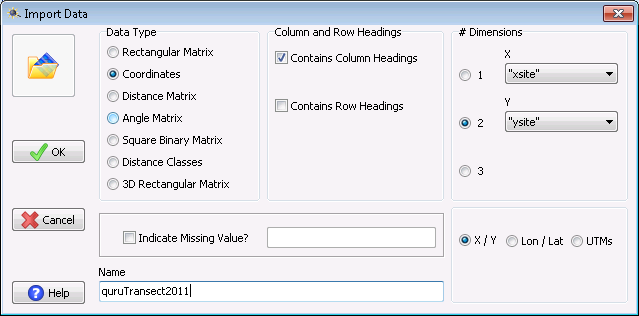
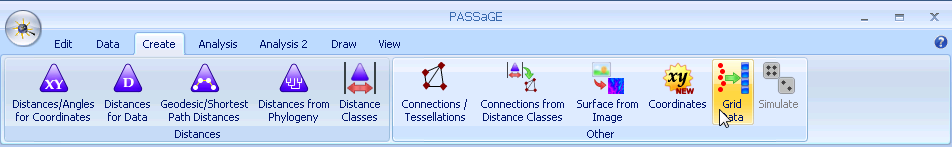

*This document, with active hyperlinks, is available online at: [https://github.com/mltConsEcol/TU_LandscapeAnalysis_Documents/blob/master/Assignments/Lab4_QuadratVarianceAnalysis.Rmd](https://github.com/mltConsEcol/TU_LandscapeAnalysis_Documents/blob/master/Assignments/Lab4_QuadratVarianceAnalysis.Rmd)*


**Due Date: Thursday, 12 February 2015**

**This assignment is worth 20 Points, with 2 points per question.**

# Introduction

In this lab, we will take be starting with the same dataset we used last week - a multi-year tree census dataset from Harvard Forest ([http://harvardforest.fas.harvard.edu/](http://harvardforest.fas.harvard.edu/), the Lyford Mapped Tree Plot Data, available at [http://harvardforest.fas.harvard.edu:8080/exist/xquery/data.xq?id=hf032](http://harvardforest.fas.harvard.edu:8080/exist/xquery/data.xq?id=hf032) .  

Though the dataset is a complete census, and can be analyzed with Ripley's K analysis as we did last week, it is rare to have such a dataset, due to the constraints in collecting data (e.g., funding, person-power, time, etc.). Thus, we will take subsets of the data that represent transects, and analyze those with quadrat variance analyses - a form of contiguous units analyses.

This lab will use [R](http://www.r-project.org/) for setting up the data, and [PASSaGE 2](http://www.passagesoftware.net/) for the analyses, which you can download for free at [http://www.passagesoftware.net/](http://www.passagesoftware.net/). There is a paper describing the software from Methods in Ecology and Evolution: [Rosenberg, M.S., and C.D. Anderson (2011) PASSaGE: Pattern Analysis, Spatial Statistics and Geographic Exegesis. Version 2. *Methods in Ecology and Evolution* 2(3):229-232.](http://onlinelibrary.wiley.com/doi/10.1111/j.2041-210X.2010.00081.x/full). 

Note that the documentation for PASSaGE, available on the software website, has very good explanations and citations for the methods employed. It may be helpful to look at that information in addition to lecture notes and reading materials.


# Setting Up and Exporting Sample Data in R

You can download the dataset and store locally to load it into R, as you did in the [previous lab](./Lab3_Import_Regress_RipleysK.Rmd). Alternatively, for datasets stored online, you can actually import them directly by using the appropriate import command and using the url of the dataset. For this lab we'll import the data and assign it to 'HTrees'. It is good practice to set your working directory to your desired folder, so do that too.

```{r}
#use 'setwd([File Path])' to set your working directory.
HTrees <- read.csv("http://harvardforest.fas.harvard.edu/data/p03/hf032/hf032-02-tree.csv")
```

To simulate a transect through part of the study area, we will only consider trees in a small strip, 20 feet wide,from x-coordinates 20 to 40, running North/South throughout the study area. We'll consider two common tree species, *Acer rubrum* and *Quercus rubrum*, and two focal years - 1969 (when the area was first censused) and 2011 (the most recent census).

We will subset the data individually for each species and each year - we only need the coorinates of the trees, so we will use the 'select' argument in the subset funtion to specify these columns:


```{r, results='hide', tidy=TRUE}
#Acer rubrum documented in transect in 1969
acruTransect1969 <- subset(HTrees, xsite >20 & xsite <= 40 & species=='ACRU' & cond69 == 'L', select=c('xsite','ysite'))
#you can plot the trees using the plotting function, like this: 
#plot(acruTransect1969$xsite, acruTransect1969$ysite)

#Quercus rubrum documented in transect in 1969
quruTransect1969 <- subset(HTrees, xsite >20 & xsite <= 40 & species=='QURU' & cond69 == 'L', select=c('xsite','ysite'))

#Acer rubrum documented in transect in 2011
acruTransect2011 <- subset(HTrees, xsite >20 & xsite <= 40 & species=='ACRU' & cond11 == 'L', select=c('xsite','ysite'))

#Quercus rubrum documented in transect in 2011
quruTransect2011 <- subset(HTrees, xsite >20 & xsite <= 40 & species=='QURU' & cond11 == 'L', select=c('xsite','ysite'))
```

To use the data in PASSaGE, we will need to export them - we'll export them as .csv files using the 'write.csv' function. These files will be written to your current working directory. You can look at the help for this function to see the arguments available, but for now, we just need the object names and desired filenames as follows:

```{r, eval=FALSE}
write.csv(acruTransect1969, "acruTransect1969.csv")
write.csv(quruTransect1969, "quruTransect1969.csv")
write.csv(acruTransect2011, "acruTransect2011.csv")
write.csv(quruTransect2011, "quruTransect2011.csv")
```

# Importing Data into PASSaGE

Now that we have the data set up, we will open up PASSaGE and get the data in. Find 'PASSaGE 2' on your computer and open it up.  

The program may look a bit daunting at first (see the following screen-shot). The 'Output' window is where text of what you do/text output from analyses will be displayed; the 'Data Monitor' window shows what data you have imported and loaded.  At the top of the screen are tabs: Edit, Data, Create, Analysis, Analysis 2, Draw, and View - which you click on different tabs, you will see the available icons change, much like when you work modern versions of Microsoft Office.


\


To get data in, click the icon at the top-left of the program (shown below) and select the 'Load Data' option:


\


Then, navigate to any one of your files of interest, and in the next window that comes up, specify that you want PASSaGE to use the Comma as the column delimiters for this file.


\


There is one more window to go through before you have your data in. Here, you will tell PASSaGE that you are importing a dataset of coordinates, specify that the dataset contains Column Headings, and indicate which columns correspond to x- and y-coordinates, as in the following image. You can also change the name of this for use in PASSaGE if you want. I'm working with the transect data for *Quercus rubrum* from 2011, and will keep the default name. When everything is set, click "OK".


\


Now you have a single dataset in PASSaGE. You can follow the same steps for the other datasets. The datasets will be listed in the Data Monitor window.  You can view the points in this dataset by going to the 'Draw' tab and clicking the 'Draw Points' icon. Because it is such a narrow transect relative to the length of it, the points may look like they are simply in a straight line unless you maximize the window to enlarge the plot.


# Setting up Quadrats in PASSaGE

We established our 'transects' in R, but for these analyses we still need to set up quadrats - square or rectanuglar areas that will serve as sample units for calculating different types of quadrat variance. Our goal in this step is to set up quadrats and get information about our data associated with each quadrat (e.g., number of trees).  We will do this using the 'Grid Data' tool in the 'Create' tab of PASSaGE. 


\


In the window that appears, you will have to specify a few things (see the following image for an example):

  1) Which set of coordinates you want to use, if you've brought in more than one set already.
  2) The number of quadrats or dimensions.
    
    * We will specify the dimensions. We know the width is 20 feet, so we can simply make the quadrats square (20 x 20).
  
  3) Leave the Format set to 'Column' and rename the output to match your dataset
  4) You will leave Type set to 'Point Count'.  If you dataset had additional fields (e.g, diameter a breast height, you could potentially calculate the summary statistics too, for each quadrat.)


\


After everything is set as desired, click "OK". You will then see the newly created datasets in the Data Monitor. In the example above, the 'quru2011' is a grid, which is similar to a Raster layer in GIS - you can use the 'Draw Surface' tool (in the 'Draw' tab) to visualize this. The 'quru2011_Coords'data is the center coordinates of each quadrat. 

Note that the Output window you will see text describing everything that you have done to this point. You can also save everything you've done by clicking the icon on at the upper-left of the program and selecting 'Save Workspace'. This will save all files as '\*.pfd' files, and a '\*.pfw', which, if you load in the future, will automatically bring in the respective .pfd files.

# Quadrat Variance Analyses


