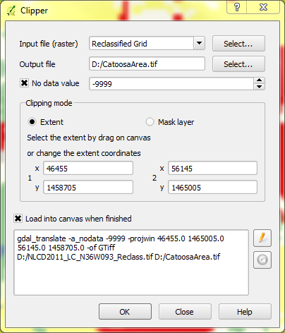
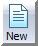

***Due Date: Thursday, 26 February 2015***

**PLEASE WRITE YOUR NAME ON ALL WORK**

**There will be 10 questions for Part 1 (given on Tuesday) and 10 for Part 2 (given on Thursday), for a total of 20 points**

#Part 1: Analyzing Categorical Rasters using FRAGSTATS

###Questions: Answer the following questions as you go through this lab. Feel free to use any materials from lecture, the internet, and FRAGSTATS documentation.

1) Before running any formal analysis in FRAGSTATS, look at the landscapes for Catoosa and Claremore areas - which do you think has a higher value for Contagion?

##Introduction

This assignment involves a few steps, which involve doing some pre-processing of categorical raster datasets, and loading them into and analyzing them in [FRAGSTATS](http://www.umass.edu/landeco/research/fragstats/fragstats.html).  Though this exercise covers some basics of preparing data for, and analyzing them within FRAGSTATS, more a comprehensive tutorial is available from the program developers at [http://www.umass.edu/landeco/research/fragstats/downloads/fragstats_downloads.html#tutorials](http://www.umass.edu/landeco/research/fragstats/downloads/fragstats_downloads.html#tutorials).

We will use data from the [2011 National Land Cover Dataset (NLCD)](http://www.mrlc.gov/nlcd2011.php), for a couple of areas near Tulsa, OK. The NLCD is available at 30 meter resolution, for the entire United States; multiple layers are available for this, including categorical land cover data, percent canopy cover and percent impervious pavement per pixel. These data are available for download via both the [Multi-Resolution Land Characteristics Consortium (MRLC)](http://www.mrlc.gov/) and [The National Map Viewer and Download Platform](http://viewer.nationalmap.gov/viewer/). You can store and work with these data in the directory of your choice - on lab computers, your University of Tusla personal directory might make the most sense.

For this lab, we will start with a 3 x 3 degree tile of the categorical NLCD layer for north-eastern Oklahoma, which includes part of Tulsa. I have made this available on the Harvey website for the course (in the Week 6 Lab folder) and also may be downloaded by clicking [this link](https://github.com/mltConsEcol/TU_LandscapeAnalysis_Documents/blob/master/Assignments/Misc/NLCD2011_LC_N36W093.zip?raw=true), but it can also be downloaded from the sources noted above. Before we get into doing actual analyses, we will go through a few pre-processing steps, often necessary in setting up the analyses we are going to go through. There are lots of different tools that can be used for these operations, but we'll use QGIS (version 2.6.1).

##Reclassify Raster
The 2011 NLCD has 20 specific potential land cover types, 15 of which occur in our focal tile. Each class is assigned a class number, as seen in the legend for this layer, available online at [http://www.mrlc.gov/nlcd11_leg.php](http://www.mrlc.gov/nlcd11_leg.php). If you use the 'inspect' tool of QGIS, you will see that each pixel has a numeric value, corresponding to legend in the previous link. The land cover classes are also grouped coarsely, as indicated by the 10s place of the ID number (e.g., all numbers in the 20s indicate varying levels of development).  Sometimes this classification scheme might not meet our needs - for example, we want to consider all classes of development as the same. To deal with this, we will reclassify the raster, using a similar process as we used in the first lab of the semester.

Import the NLCD layer into QGIS as you would any other raster layer - the resulting layer should look something like the image below - look at the legend in the link above to discern different land cover classes. According to the metadata (in a .html file that comes in the folder with this dataset), the data are in an Albers Equal Area projection; if you import some Google or Bing (or other)imagery and ensure that on the fly projection is enabled, that layer should appear in northeastern Oklahoma. The horizontal units for this projection layer are meters, which is important to know for later steps. You can also set the CRS for this layer to the standard EPSG code, 5070. (This won't change the projection, but will designate the corresponding EPSG code).

\

Then, go to the Processing Toolbox, to SAGA, and find "Grid-Tools"; then, double click "Reclassify grid values"

\

In the window that pops up, you will designate the settings for this operation. These below settings will work for this lab - in the future, you can adjust these settings according to your own needs. After setting up all of the options, click 'Run'.

* Under 'Grid', chose the appropriate layer (NLCD2011_LC_N36W093).
* For 'Method', choose 'Range'.
* Set the minimum and maximum values for the range option as 21 and 24, respectively. This tells the operation that you want to reclassify values from 21 through 24 to a new value.
* For 'new value (for range)', set the value to 20, and leave the 'operator (for range)' set to the default ('[0]<=').
* Un-check the boxes for 'replace no data values' and 'replace other values'.
* Designate a 'Reclassified grid' for your output file - saving it as a .tif file generally works well.

\

After this operation, your newly reclassified layer will appear in QGIS in gray-scale colors. In the list of layers in QGIS you can simply right click on the original NLCD, select 'Copy Style', and then right click on the new layer and select 'Paste Style' - this will apply the original color palette to this new layer.  Note, the areas classified as 'Developed', now designated as class 20, will appear black - that is because there was previously no class number 20 - you can go to the style settings (in the layer properties) and designate a color for class 20. The result may look something like the image below (in which I've set the color for class 20 to be a bright red).

\

##Clipping Areas for Analysis
Now that we have the desired land cover classes for this analysis, we can focus on extracting a couple of areas for analysis. Again, there are numerous ways to do this - what is shown here is probably among the simplest and easiest, albeit we will be ignoring bordering pixels. 

We will use the Raster Clipper tool in QGIS to extract two focal areas for this analysis: an area near Catoosa, OK that we have highlighted during lab, and a nearby area of Claremore, OK.  The corresponding extents will be as follows:

* **Catoosa Area** Lower Left: x = 46455, y = 1458705; Upper Right: x = 56145, y = 1465005
* **Claremore Area** Lower Left: x = 30075, y = 1469655; Upper Right: x = 39765, y = 1475955

For each area, go to the Raster menu at the top of the QGIS window, mouse over 'Extraction' and click 'Clipper'. 

\

In the window that opens, you can select the layer you want to clip (the reclassified NLCD layer), designate the output file, set the 'Clipping mode' to 'Extent', and fill in the coordinates. I typically set the 'No data value' to -9999, to avoid any confusion of my focal area includes locations without data. This is not the case for this area, but can be good practice. The image below is the setup for the Catoosa area; *you will also need to do this for the Claremore area (designated above)*.

\

The two areas are nearby, and your results should look like this: 

\

##Load Data Into FRAGSTATS
Now that we have a couple of landscapes to analyze, we can import them to FRAGSTATS.  Open FRAGSTATS on your computer - you should be able to find it in your Start Menu. When the program opens up, the screen will appear blank; click the 'New' icon at the top and the screen below should appear \.

\

Click the 'Add layer...' button. Then, chose the file type you will import (GeoTIFF grid for these data), and browse to your dataset. In this case we have no 'Background value', but if you wanted to consider one of your classes as a background, you could indicate that class number in that box.  The rest of the information should be filled in automatically.  For the Catoosa area, this window should look like the image below.

\

*Note the 'Cell Size' is identified as '30.00'. FRAGSTATS assumes this is in meters, and all area and perimeter calculations will be based on this cell size. This is correct, and can be confirmed via the metadata and checked by measuring pixels while zoomed in within QGIS. If your layer is in projected coordinates (i.e., Lat/Long), it is wise to reproject to a meter-based coordinate reference system prior to analysis.*

You can import the NLCD for the Claremore area too.

For this lab, we will only import one other file - the 'Class Descriptors' file, 'NLCDClasses.fcd'.  You can download it from the Harvey website under Week 6 lab material, or you can view it at [this link](https://raw.githubusercontent.com/mltConsEcol/TU_LandscapeAnalysis_Documents/master/Assignments/Misc/NLCDClasses.fcd). If you are simply viewing this online, you can copy and paste it into a text file (e.g., with Notepad on Windows), and save it as 'NLCDClasses.fcd'. If you downloaded the file from Harvey, open it with Notepad and explore it - this file simply tells FRAGSTATS which names correspond to the numeric land cover codes. I set this up for you, with the land cover classes that might be in these areas (and with the Developed classes all categorized as a single class), but you can easily create a similar file or adjust this for your own purposes.

One last thing that we will set is the edge depth, required for computing Core Area metrics. We will set a fixed edge depth for all land cover classes; check the box for 'Use fixed edge depth', click the '...' icon, and for now set the value to 30. 

If you wanted to use different edge depths for different land cover classes, you could use a file, similar to the Class Descriptors file; similarly, you can use files to specify similarity and contrast between different classes. This is described in detail in the [tutorial material available from the FRAGSTATS developers](http://www.umass.edu/landeco/research/fragstats/downloads/fragstats_downloads.html#tutorials).

At this point the left portion of the screen, with the 'Input Layers' tab, should look similar to this: 

\

