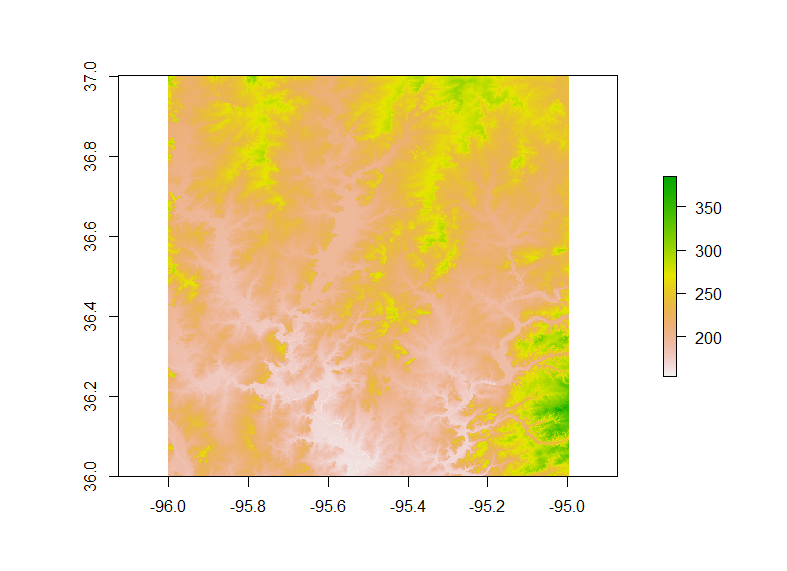
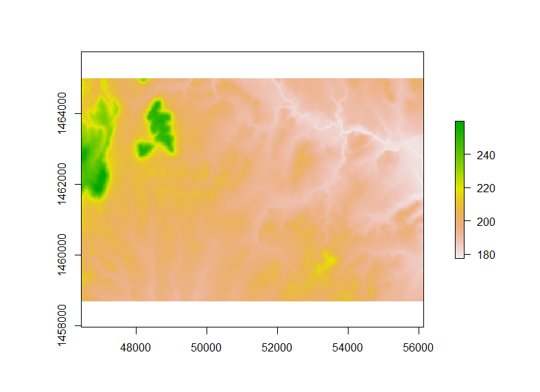

***Due Date: Thursday, 26 February 2015***


*There will be 10 questions for Part 1 (provided on Tuesday) and additional questions for Part 2 (provided on Thursday), for a total of 20 points. All answers are due on the date specified above. PLEASE WRITE YOUR NAME ON ALL WORK*


#Part 2: Calculating Some Surface Metrics

###Part 2 Questions - Answer the following questions as you go through this lab. Feel free to use any materials from lecture, the internet, and supplemental reading materials posted on Harvey (in particular [McGarigal, K., S. Tagil, and S. Cushman. 2009. Surface metrics: an alternative to patch metrics for the quantification of landscape structure. Landscape Ecology 24:433-450](http://link.springer.com/article/10.1007%2Fs10980-009-9327-y), and the supplement associated with it). Be sure to include your name with your answers.

1) Produce basic plots of elevation for Catoosa and Claremore (include them in your answer sheet).

2) Which landscape (Catoosa or Claremore) has a higher mean elevation? 

3) How do the histograms of the two focal landscapes compare? Is one more skewed or peaked than the other? (which area, and in which direction - does the tail extend further to the left or right?) Which landscape seems to have more even terrain based on the histograms?

4) Which landscape is rougher? Is the answer the same when you compare Average Roughness and the Standard Deviation of elevation? (If not, why might that be?)

5) Which landscape has higher average slope? Give the value in both radians and degrees.

6) Compare the histograms for slope - do you notice any major differences in the shapes? or are they generally uniform? If you see major differences, elucidate what might cause that (feel free to look at the digital elevation model and slope maps if that helps).

7) Calculate the 'average roughness' for slope of each landscape. Provide the R code you used. (Remember, this is a metric of how much variation there is in slopes present.)

8) Surface metrics could potentially be combined with the patch mosaic paradigm. How would you apply surface metrics to individual patches? (Just a brief description is sufficient).

9) Surface metrics for continuous raster layers and landscape/patch mosaics each have benefits and applicability in different situations. When/how might surface metrics be better for quantifying a pattern of a landscape? Provide an example from one of your study systems.

10) When/how might landsacpe/class/patch metrics be better for quantifying a pattern of a landscape? Provide an example from one of your study systems.

##Introduction

In its current version, FRAGSTATS is a powerful tool for working with categorical raster layers. Though planned future versions will calculate surface metrics  for continuous rasters (described in the [McGarigal et al. 2009](http://link.springer.com/article/10.1007%2Fs10980-009-9327-y) paper listed above), this feature is not currently implemented. Surface metrics can allow you to characterize landscapes (and patches) according to continuous variables (e.g., elevation, slope, percent canopy cover, percent Software designed to calculate surface metrics can be expensive, though we can calculate some metrics pretty easily using [R](http://www.r-project.org/). We will only focus on a couple here will, but this lab will also familiarize you with working with raster datasets in R.

Though R was developed for statistical computing, the R programming language can be used for a wide variety of tasks, and it can integrate with other languages. Thus, myriad packages have been developed for importing data of various formats, and manipulating them in countless ways. For working with spatial data in particular, numerous packages are available, generally outlined in this Task View: [http://cran.r-project.org/web/views/Spatial.html](http://cran.r-project.org/web/views/Spatial.html). For this lab we will use the 'raster' package and s ome dependencies:
  * [rgdal](http://cran.r-project.org/web/packages/rgdal/); 
  * [raster](http://cran.r-project.org/web/packages/raster/); and 
  * [rgeos](http://cran.r-project.org/web/packages/rgeos/). 
  * [sp](http://cran.r-project.org/web/packages/sp/); 

  
We will do some minor data preparation, similar to as we did in Part 1, but this time we will use R instead of QGIS, to highlight some of what we can do in R. In your own work, you can use the tools of your preference, both are powerful and have their own advantages (e.g., R is a simple language to program and script your work in, but might take more work to figure out commands and can be slower for big datasets; QGIS has a GUI (graphical user interface) and is fast for processing, but programming/scripting requires learning another language, Python).

Our analyses will focus on the 30 meter [National Elevation Dataset](http://ned.usgs.gov/) for the same areas as we used in Part 1 (near Catoosa and Claremore, Oklahoma, USA). 
    * An appropriate 1 x 1 degree tile (tile n36w096) is available on the Harvey website for this class and [here](./Misc/n37w096.zip?raw=true) as a .img file.
      * You should un-zip the file and place it in your preferred file location before conducting analyses.
      * You can also download this layer from from [The National Map Viewer](http://viewer.nationalmap.gov/viewer/). 
    
*For your own analyses, some layers that you may be interested in are Percent Impervious Cover and Percent Canopy Cover from the the [2011 National Land Cover Dataset](http://www.mrlc.gov/nlcd2011.php). You can download these for the conterminuous United States from the NLCD website, or in 3 x 3 degree tiles or state extents from [The National Map Viewer](http://viewer.nationalmap.gov/viewer/).*


##Installing and Loading R Packages

For an introduction to R and R packages, see the [Intro to R material](./Lab2_IntroToR.RMD) and the beginning of the [Lab 3 material](Lab3_Import_Regress_RipleysK.Rmd) associated with this course.

You will need to install the packages listed above. the package 'sp' comes with R, but the others need to be installed - you can do this using the 'install.packages' function. Once packages are installed, you can load them using the 'library' function. 

*Note: For Macs, check out instructions for installing rgdal and rgeos at the following link - note, you'll need to install plain geos and gdal before installing the respective R packages: [http://tlocoh.r-forge.r-project.org/mac_rgeos_rgdal.html](http://tlocoh.r-forge.r-project.org/mac_rgeos_rgdal.html)*

For example, for the raster package, use this code:

```{r, eval=FALSE, tidy=TRUE}
#To install a single package:
install.packages('raster') 

#To install multiple packages at once, follow this example:
install.packages(c('raster', 'rgeos'))

#To load packages (must be done individually for each package; when a package has dependencies, the dependencies will be loaded when you load the main package you are loading):
library(raster)
library(rgeos)
```


##Loading Raster Layers Into R; Finding Projection Info & Reprojecting Layer
As you get started, you should set your working directory to your desired folder location (use the 'setwd' function), where you should have the data you'll be working with stored. 

The function to import a raster is pretty simple - just the 'raster' command in the package of that name. This function is pretty flexible, and can be used to create blank rasters, or import existing raster files. You can plot a raster using the 'plot' command. *Note: with the raster package open, if you look up the help for 'plot' in R, you will be asked to choose help for generic plotting functions or for plotting a raster - in this case you would want the help for plotting a raster.*

```{r, eval=FALSE, tidy=TRUE}
dem <- raster('imgn37w096_1.img')

#Plotting may take a minute or two - if you wait until we have clipped rasters for our focal areas, it will be much quicker as this function will  be plotting smaller areas (i.e., less pixels).
plot(dem)
```

\

As with any other R object, we can look at the structure, identify the class, etc. You can also calculate the summary statistics - because Raster layers typically have a large number of values (in individual pixels), it will typically take a sample of values for these computations and note that.

```{r, eval=FALSE}
str(dem)
class(dem)
summary(dem)
```

In the structure there is a lot of information, summarizing some important characteristics of the raster (e.g., the boundaries of the layer, the class of object, and the coordinate reference system). The raster layer is an object of class 'RasterLayer', associated with the 'raster' package.  Also, note that the coordinate reference system is  "+proj=longlat +datum=NAD83 +no_defs +ellps=GRS80 +towgs84=0,0,0" - thus, the data are in projected coordinates (latitude/longitude), in datum WgS 84. 

If you look at the metadata for this layer (the .html file in the folder with the DEM), you will find that the height values (i.e., vertical units) are in meters; for some calculations such as slope, it is better to have the horizontal units the same as the vertical units. Thus, we will reproject the layer to a meter-based CRS. For consistency with the National Land Cover Dataset, we will simply use an Albers Equal Area Projection (EPSG code: 5070). The command for this is 'projectRaster'. As shown in the examples within the help, you can simply assign the re-projected raster to a new object, operating the function on the existing raster, and indicating what CRS you wish to use. You can also specify the interpolation (nearest neighbor would be for a categorical raster; bilinear is the default, and that or cubic spline is generally appropriate for continuous rasters). This function expects the CRS in a different format: 'PROJ.4' description of the CRS. To figure out how to convert the EPSG code to the PROJ.4 format, I typically do a web search something like "EPSG 5070 PROJ.4". The first result is [http://epsg.io/5070-1252](http://epsg.io/5070-1252) - if you scroll down, on the left hand side you will see a list under the heading 'Export' - click on 'PROJ.4' and it will show you how this EPSG code is represented in the PROJ.4 format. 
  
  * "+proj=aea +lat_1=29.5 +lat_2=45.5 +lat_0=23 +lon_0=-96 +x_0=0 +y_0=0 +ellps=GRS80 +towgs84=1,1,-1,0,0,0,0 +units=m +no_defs"

You could alternatively get this from QGIS - when you are in the window for setting the projection of a layer, it displays the text for the PROJ.4 code of the projection that is highlighted. We can now reproject the data:

```{r, eval=FALSE, tidy=TRUE}

demAlbers <- projectRaster(dem, crs = "+proj=aea +lat_1=29.5 +lat_2=45.5 +lat_0=23 +lon_0=-96 +x_0=0 +y_0=0 +ellps=GRS80 +towgs84=1,1,-1,0,0,0,0 +units=m +no_defs")

```

Now we are ready to clip the raster to the respective areas - we will use the same boundaries for Catoosa and Claremore as in part 1 of this lab (see the lab 1 handout for the coordinates). We will set up extents that we wish to crop the layer to using the appropriate coorinates, and crop to those. The main functions we will use are 'extent' and 'crop'.  Below is an example for the Catoosa area - use do the same for the Claremore area on your own.

```{r, eval=FALSE, tidy=TRUE}
CatoosaExtent <- extent(46455, 56145, 1458705, 1465005)
#the order expected is 'xmin, xmax, ymin, ymax'

demCatoosa <- crop(demAlbers, CatoosaExtent)

#Plot to verify that this appears coorect:
plot(demCatoosa)
```

\


##Calculation of Surface Metrics
Now that you have these focal landscapes clipped out, you can calculate surface metrics. Note that you can do regular math with rasters, adding and subtracting, multiplying, and dividing, etc., but to get specific statistics for a layer, you need to use the 'cellStats' function (see below. You can also view the histogram for this each layer using the simple 'hist' function.

```{r, eval=FALSE}
hist(demCatoosa)
demCatoosaMean <- cellStats(demCatoosa, mean)
```

One of the surface metrics we can look at is Average Roughness - or the average deviation from the mean. There are a few calculations we need to do:
  1) calculate the mean (as shown above);
  2) then, calculate a new value for every pixel, as the absolute value of the differene between the pixel value and the mean for the area; and
  3) calculate the mean of the raster computed in Step 2.
  
Here is an example of this for Catoosa, broken out into multiple steps, but it could be combined into a single line of code.

```{r, eval=FALSE}
demCatoosaMean <- cellStats(demCatoosa, mean)
demCatoosaDeviance <- abs(demCatoosa - demCatoosaMean)
CatoosaAvgRough <- cellStats(demCatoosaDeviance, mean)
```

Another metric we can look at for roughness is the standard deviation of the elevation within a landscape. I won't provide this code here, but you will need to calculate it for the assignment (hint: search around for the R function to calculate the standard deviation; you will need to use the cellStats function).

##Deriving Other Topographic Variables from Raster Layers

With digital elevation models, we often want to compute derivitives from the layer - for example, slope and aspect are among the most commonly used layers derived from DEMs. A convenient function for this is 'terrain' in the raster package. Check out the help for this, and look at the options and details for what can be computed using this function.

As an example, we will calculate slope.

```{r, eval=FALSE}
slopeCatoosa <- terrain(demCatoosa, opt='slope', units='degrees')
```

Although this example of slope is for elevation, you can also calculate the 'slope' of other values, as slope is just the first derivative (rate of change) of values across the horizontal plane. Thus, you can do this for percent (or proportion) of impervious surface per pixel, or of percent canopy cover per pixel (e.g., from the National Land Cover Dataset).

Note, you can set the units for slope and aspect as either degrees or radians - degrees are typically more intuitive to most users, but radians are often used for some other calculations, and might sometimes be preferable. In particular, aspect is frequently converted to metrics of 'northness' and 'eastness', each ranging -1 - 1. This is because an aspect of 0 and 360 is the same (both face north), so northness and eastness break this down into two other components. Northness is calculated as the cosine of aspect (in radians), and eastness is calculated as the cosine of aspect (again, in radians). 1 represents East or North, and -1 represents West or South, respectively. With the resulting rasters from these terrain calculations, you can easily calculate the roughness metrics previously mentioned. *You do not need to do this for this lab, but it is important to be aware of these calculations if you are working with continuous raster datasets. If you want to calculate other surface metrics described in the McGarigal et al 2009 paper, let me know and we can try to do this in R*.

It is also be possible to calculate the surface metrics for individual patches (e.g., average roughness of a patch) - you would need to import a Patch ID output file from FRAGSTATS, convert the raster to polygons, and use the extract function to extract information from the raster layers to your polygons file. The functions you would need are 'rasterToPolygons' and 'extract'; to export the resulting dataset (polygons with the corresponding metrics in the attribute table), you should be able to use the 'writeOGR' function. We will cover some of these steps in a future lab.

