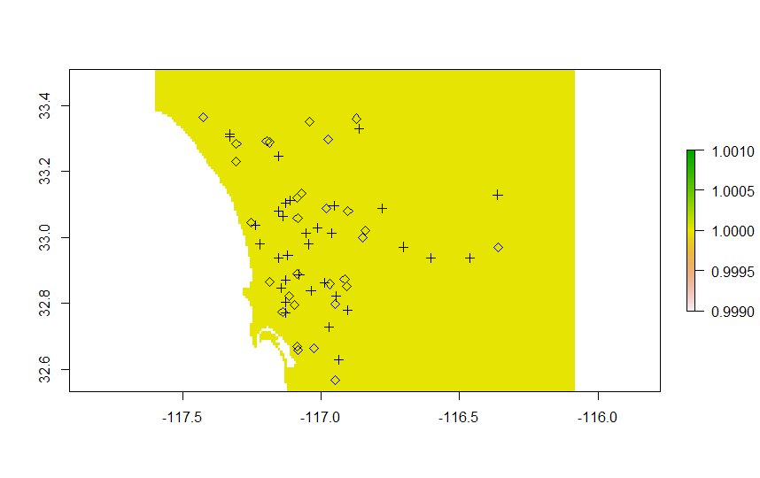
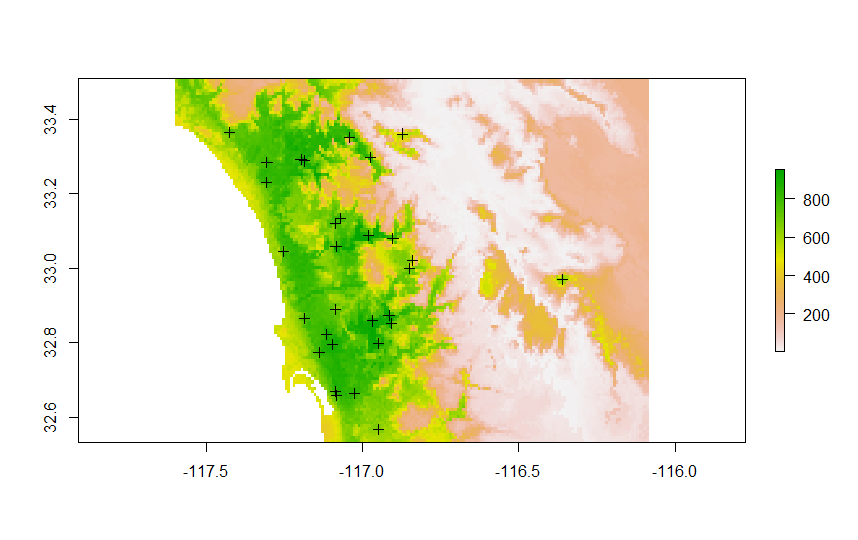
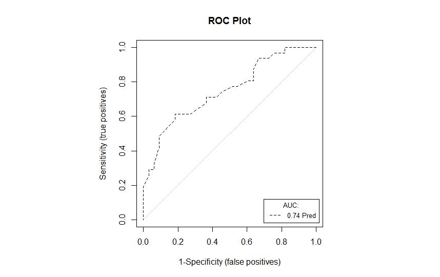

*This document, with active hyperlinks, is available online at:[https://github.com/mltConsEcol/TU_LandscapeAnalysis_Documents/blob/master/Assignments/Lab8_SpeciesDistributionModeling_Pt2.Rmd](https://github.com/mltConsEcol/TU_LandscapeAnalysis_Documents/blob/master/Assignments/Lab8_SpeciesDistributionModeling_Pt2.Rmd)*

**Due Date: Thursday, 2 April 2015**

***PLEASE WRITE YOUR NAME ON YOUR ANSWER DOCUMENT***

#Questions

1) In the distribution models for Least Bell's Vireo, developd in this lab, we only looked at long-term climate related variables and elevation. Name two other variables or types of that might be important for a species' distribution across the long-term (i.e., what variables might be useful in identifying sites that could have served as habitat at some point, or could potentially be used to create habitat into the future?) Give a brief explanation of why.

2) If you were trying to inform current conservation efforts for the Least Bell's Vireo, name two variables might be particularly important to include in distribution models to understand how anthropogenic changes to the landscape influence patterns of the species' occurence - give a brief explanation.

3) Run the distribution models as described in Part 1 of the lab. Which algorithms appear to perform the best? Which appear to perform the worst?

4) Look at the response curves for the models you just developed, for the best-performing algorithm. Are there any clear patterns in how the probability of presence changes along environmental gradients? Indicate which variable seems to show the strongest pattern - don't give just the abbreviation, but look up the information on Bioclim layers to figure out what that variable means.


5) Make projections of the species' distribution back to the current landscape conditions. 

    a) Paste maps from the best- and worst- performing algorithms into your answers. (You can include all model runs).
    b) Are there any clear differences? Does one algorithm seem to be predicting more habitat than the other?

6) Run the distribution models again, assigning them to a different name, but use a reduced set of variables, avoiding highly correlated variables. Which models appear to be performing the best and worst? 

7) Look at the response curves, for the same algorithm that performed best with all variables included, but with the reduced variable set. How do the response curves for the variables kept in the models differ vs. the ones you looked at in question 4? 

8) Which set of models have more interpretable patterns? The ones with all variables? Or models with reduced variable-set? Justify your answer, and give a suggestion of why this might be happening.

9) Look at the evaluation metrics for the models you've developed, with all variables, and with a reduced set of variables. 

    a) In general, did models perform better or worse with all variables included? Why do you think you are seeing this result?
    b) For what ecological/conservation/evolutionary questions might you prefer to use all variables vs. only a selected set of variables? You can give an example of a scientific question you might be trying to answer with the different sets of variables.

10) Look into the help file for BIOMOD_Modeling in R (Or look in the PDF documentation, here: [http://cran.r-project.org/web/packages/biomod2/biomod2.pdf](http://cran.r-project.org/web/packages/biomod2/biomod2.pdf)). List two other algorithms that can be implemented in this package. 


#Introduction

In the first part of this lab, we got some practice in simply developing some species distribution models using the [biomod2](http://cran.r-project.org/web/packages/biomod2/index.html) package. It is powerful, with capabilities for developing predictions of species' future ranges, and can be set to create pseudo-absence points. Furthermore, it can run multiple models at once, and you can simply look at evaluation metrics for each model run; you can also combine models using "Ensemble Modeling" approaches.

It is helpful to be able to develop these models on your own, or at least work with parts of the data to do things in particular ways.  For example, it is good practice to evaluate correlation between predictor variables. Additionally, when we have presence-only species datasets, we might want to select pseudo-absences with the same bias as our occurrence data.

We will be working with the sdame datasets as in [part 1](https://github.com/mltConsEcol/TU_LandscapeAnalysis_Documents/blob/master/Assignments/Lab8_SpeciesDistributionModeling_Pt2.Rmd) of the lab.

In this lab we'll need the following packages:

* sp
* rgdal
* raster
* kernlab
* ks
* sm
* usdm
* PresenceAbsence


#Import Data and Prepare for Analyses

We will import and process the data the same way we did on Thursday - here is the respective code. (Don't forget to download, unzip, and move the datasets to your preferred working directory).


```{r, tidy=TRUE, eval=FALSE}
#Set working directory with 'setwd(...)'

bell <- read.table("M_ater_obscurus.txt", sep="\t", header=TRUE, fill=TRUE, quote="")
bell <- bell[,c("decimallongitude", "decimallatitude")] 
bell <- na.omit(bell) #Remove any values where latitude or longitude coordinates are NA
bell <- unique(bell) #Only keep unique values - removes duplicate rows
bell.sp <- SpatialPoints(cbind(bell$decimallongitude, bell$decimallatitude))
proj4string(bell.sp) <- "+proj=longlat +datum=WGS84 +no_defs"
sdbound<-readOGR("./County_Boundary/COUNTY_BOUNDARY.shp", layer="COUNTY_BOUNDARY")
dem <- raster("SanDiego_1ArcSecondDEM_NED.tif")
setwd("Bioclim_Tile12")
bioclim <- stack(list.files(pattern="*.tif$", full.names=TRUE))
sdbound.dem <- spTransform(sdbound, crs(dem))
sdbound.bioclim <- spTransform(sdbound, crs(bioclim))
dem.crop <- crop(dem, sdbound.dem)
bioclim.crop <- crop(bioclim, sdbound.bioclim)
dem.bioclim <- projectRaster(dem.crop, bioclim.crop)
PredVars <- stack(bioclim.crop, dem.bioclim)
bell.sp.bioclim <- spTransform(bell.sp, crs(PredVars))

#Set the working directory back to where you originally had it (instead of 'Bioclim_Tile12') - using ".." simply goes to one directory-level higher.
setwd("..")
```


We'll set up our own pseudo-absence points it can be easier to set these up in the same dataset as the presences (and biomod2 requires that if you are using your own absences or pseudo-absences). Thus, while the presence data are currently a SpatialPoints object, we'll convert it to a SpatialPointsDataFrame, with 1s and 0s in a column of the associated table indicating presence and absence, respectively.

```{r, tidy=TRUE, eval=FALSE}
#Create a vector, with the same number of values as there are presence points - we'll call it "Presence Absence"
PresAbs <- rep(1,length(bell.sp.bioclim))

#TUrn the vector into a dataframe
PresAbs <- as.data.frame(PresAbs)

#Turn the locality points into a SpatialPointsDataFrame - use the 'data' argument to indicate what dataset is getting associated with the points
bell.sp.bioclim <-SpatialPointsDataFrame(bell.sp.bioclim, data=PresAbs)

#You can view the dataframe associated with the SpatialPointsDataFrame by using the '@' symbol following the name of the SpatialPointsDataFrame
head(bell.sp.bioclim@data)
```

#Checking for Collinearity in Predictor Variables

Some species distribution modeling  algorithms (e.g., generalized linear model) assume predictor variables are not correlated, whereas with others, it can cause mis-interpretation of variable importance - for example, machine learning techniques will often pick up on a one of the correlated variables as being important, but not others. Thus, it is important to at least be aware of the coorelations.

First, we can look at the pairwise correlations among all variables at once using the 'pairs' function. This function also exists for regular datasets, to compare multiple vectors at once (though that does not autocalculate correlations at the same time which you'll see here)

```{r, tidy=TRUE, eval=FALSE}
#This first line does all variables at once - can take a while to process - we have 20 variables here (19 bioclim + elevation)
#pairs(PredVars)

#To view only selected variables indicate the layers with numbers in double brackets; You can use 'names(PredVars)' to see which layer is which
pairs(PredVars[[1:3]])
pairs(PredVars[[c(1,4,6,20)]])
```

The package '[usdm](http://cran.r-project.org/web/packages/usdm/index.html)' has useful functions to detect collinearity in predictor variables. It can be used to identify variables with correlation above user-defined thresholds, or and can use a stepwise procedure to identify a set of variables that will have low Variance Inflation Factors (VIF). 

```{r, tidy=TRUE, eval=FALSE}
#The 'vif' function calculations VIFs for each variable, with all variables present
vif(PredVars)

#identify variables using 'vifcor' or 'vifstep' that have little correlation based on correlation coefficients or VIFs- can be defined as an object and used to take an appropriate subset of variables
vifcor(PredVars, th=0.85) 
# The above identifies variables with correlation coefficients < 0.85; can also be assigned to an object

PredVars.NoCor <- vifstep(PredVars, th=10) 
#Creates 'VIF' object listing variables that, together, have VIFs < 10 - this is a fairly standard threshold to use
#If you simply call PredVars.NoCor it will show the variables and the VIF values


#Use the object created in the previous line to actually reduce the Predictor variables to be an uncorrelated set
PredVars.Reduced <- exclude(PredVars, PredVars.NoCor)
```

Now, we can run the same models as in the previous lab, but with the reduced variable-set:

```{r, tidy=TRUE, eval=FALSE}
#Set up data for model
LeastBellVireo.ModelData.Red <- BIOMOD_FormatingData(
  bell.sp.bioclim, 
  PredVars.Reduced, #Designate you're using the reduced predictor variables
  resp.name="LeastBellVireo",
  PA.nb.rep=10, #10 different sets of pseudo-absence points created;
#models will be run once for each set of pseudo-absences
  PA.nb.absences=length(bell.sp.bioclim) #Set the number of pseudo-absence
#points equal to the number of presences (indicated by 'length(bell.sp.bioclim))
  )

#We'll indicate that we want to use the default settings for all algorithms:
myBiomodOption <- BIOMOD_ModelingOptions()

#'models1.reduced' will be an object containing the output from the model runs
models1.reduced <- BIOMOD_Modeling(LeastBellVireo.ModelData.Red,
                models=c('GLM','RF', 'MARS','SRE'),
                #in the above line you can add other algorithms here
                #the more you sue the longer it will take
                model.options = myBiomodOption #indicate model options here         
                )
```

You can now use the commands provided in the first part of this lab to look various aspects of the models results.


#Creating Pseudo-Absences with Same Bias as Occurrence Data

Though biomod2 has a few options for selecting pseudo-absence data points, one that is not included but has been documented as working well is selecting pseudo-absence locations with the same bias as the occurrence points (see [Phillips et al. 2009. Ecological Applications 19(1):181-197](http://www.esajournals.org/doi/abs/10.1890/07-2153.1) for details).

This code creates pseudo-absences of this sort - there are lots of things that can be adjusted, but gives a good start. This code was adapted from supplementary materials of [Fitzpatrick et al. 2013. Ecosphere 4(5): Article 55](http://www.esajournals.org/doi/abs/10.1890/ES13-00066.1). This involves creating a probability surface for the study area, with a Kernetl Density Estimator (KDE), where higher probability values are assigned to areas with more locality points. Then, pseudo-absences are selected probabilistically, based on that surface. 

***You won't need to implement this in this lab - if you wish to try incorporating it into your final project, I will work with you to try and accomplish this.***


```{r, eval=FALSE}
#First, set up the data
mask <- PredVars.Reduced[[1]]>-1000 #Create a 'mask'
#basically just a layer that indicates where cells should be NA
#You can plot the mask to see what it looks like
bias <- cellFromXY(mask, bell.sp.bioclim) #Identify which cells have points
cells <- unique(sort(bias)) #Make sure there are no duplicates in the cell IDs
kernelXY <- xyFromCell(mask, cells) #Get XY coordinates for the cells, from the mask
samps <- as.numeric(table(bias)) #Count how many locality points were in the cells

# code to create KDE surface
KDEsur <- sm.density(kernelXY, weights=samps, display="none")
KDErast=SpatialPoints(expand.grid(x=KDEsur$eval.points[,1], y=KDEsur$eval.points[,2]))
KDErast = SpatialPixelsDataFrame(KDErast, data.frame(kde = array(KDEsur$estimate, 
                                                    length(KDEsur$estimate))))
KDErast <- raster(KDErast)
KDErast <- resample(KDErast, mask)
KDErast <- KDErast*mask #Excludes areas outside the study area based on the Mask layer
KDEpts <- rasterToPoints(KDErast, spatial=F) #(Potential) PseudoAbsences are created here 
plot(KDErast) #Plot the KDE to see what it looks like

#Now to sample for Pseuooabsences Presence Data
a=KDEpts[sample(seq(1:nrow(KDEpts)), size=nrow(bell.sp.bioclim@data), replace=T,
                prob=KDEpts[,"layer"]),1:2]
Presence<-data.frame(Presence=rep(0,nrow(a)))
a.sp<-SpatialPoints(a, proj4string=crs(PredVars.Reduced))
bell.sp.bioclim@data$PresAbs<-as.numeric(bell.sp.bioclim@data$PresAbs)
a.spdf<-SpatialPointsDataFrame(a.sp, PresAbs)
a.spdf$PresAbs <- 0 #Set values for PresAbs column of Absences to 0
PresAbs.spdf<-rbind(bell.sp.bioclim[1],a.spdf) #Join Presences and Absences into 
#Single Dataset

#You can plot the results like this
plot(mask) #Plot the mask layer as a background
plot(a.spdf, add=T) #Plot the absences
plot(bell.sp.bioclim, add=T, pch=5) #Plot the Presences
```

The result should look something like this: 

\

Then, you can set up and run the models, removing arguments for establishing Pseudo-Absences. You create multiple pseudo-absence datasets, run the models once for each, and then compare the models with different pseudo-absences, and perhaps average them.

To set up the model, here is some sample code:

```{r, eval=FALSE, tidy=TRUE}
LeastBellVireo.ModelData.Red.PresPseudoAbs1 <- BIOMOD_FormatingData(
  PresAbs.spdf, 
  PredVars.Reduced, #Designate you're using the reduced predictor variables
  resp.name="LeastBellVireo.PresPseudoAbs1", #Name this uniquely
  )
```

Then, you can run the models individually using the 'BIOMOD_Modeling' function, adjusting the arguments as you see fit.

#Working with Model Projections

When you create models in biomod2, output from the model is automatically saved to your working directory, in a folder by the name assigned in the argument 'resp.name' in the formatting data step.  When you carry out the projection step, the associated files also get saved into a sub-folder, named as you assigned in the 'proj.name' argument. The files are saved in an R-readable format, comprised of two files - '.grd' and '.gri'.

You can easily re-import these projections as a raster stack - for example, with the models developed in the first part of the lab (on Tuesday), you should be able to import projections using the below code:

```{r, tidy=TRUE, eval=FALSE}
projections <- stack("/LeastBellVireo/proj_current/proj_current_LeastBellVireo.grd")
```

You can use the 'names' function to see which projection layer corresponds to particular models (e.g, 'names(projectoins)'. You can also do raster-math on these to calculate averages, as below.

```{r, tidy=TRUE, eval=FALSE}
names(projections)

[1] "LeastBellVireo_PA1_Full_GLM"   "LeastBellVireo_PA1_Full_RF"    "LeastBellVireo_PA1_Full_MARS" 
 [4] "LeastBellVireo_PA1_Full_SRE"   "LeastBellVireo_PA2_Full_GLM"   "LeastBellVireo_PA2_Full_RF"   
 [7] "LeastBellVireo_PA2_Full_MARS"  "LeastBellVireo_PA2_Full_SRE"   "LeastBellVireo_PA3_Full_GLM"  
[10] "LeastBellVireo_PA3_Full_RF"    "LeastBellVireo_PA3_Full_MARS"  "LeastBellVireo_PA3_Full_SRE"  
[13] "LeastBellVireo_PA4_Full_GLM"   "LeastBellVireo_PA4_Full_RF"    "LeastBellVireo_PA4_Full_MARS" 
[16] "LeastBellVireo_PA4_Full_SRE"   "LeastBellVireo_PA5_Full_GLM"   "LeastBellVireo_PA5_Full_RF"   
[19] "LeastBellVireo_PA5_Full_MARS"  "LeastBellVireo_PA5_Full_SRE"   "LeastBellVireo_PA6_Full_GLM"  
[22] "LeastBellVireo_PA6_Full_RF"    "LeastBellVireo_PA6_Full_MARS"  "LeastBellVireo_PA6_Full_SRE"  
[25] "LeastBellVireo_PA7_Full_GLM"   "LeastBellVireo_PA7_Full_RF"    "LeastBellVireo_PA7_Full_MARS" 
[28] "LeastBellVireo_PA7_Full_SRE"   "LeastBellVireo_PA8_Full_GLM"   "LeastBellVireo_PA8_Full_RF"   
[31] "LeastBellVireo_PA8_Full_MARS"  "LeastBellVireo_PA8_Full_SRE"   "LeastBellVireo_PA9_Full_GLM"  
[34] "LeastBellVireo_PA9_Full_RF"    "LeastBellVireo_PA9_Full_MARS"  "LeastBellVireo_PA9_Full_SRE"  
[37] "LeastBellVireo_PA10_Full_GLM"  "LeastBellVireo_PA10_Full_RF"   "LeastBellVireo_PA10_Full_MARS"
[40] "LeastBellVireo_PA10_Full_SRE" 

#You can plot individual projections using code like this:
plot(projections[["LeastBellVireo_PA1_Full_GLM"]])
plot(projections[[1]]) #Same result as above

#Average all projections
projections.mean <- mean(projections)

#We can subset the projections to only get results from Random Forests, and average those:
# First, subet- the function 'grep' is a search function effectively - 
#searching for 'RF' in the names of the layers in the 'projections' object
projections.RF <- subset(projections, grep("RF", names(projections)))

#Verify that is coorect
names(projections.RF)

#Average Random Forest Projections and plot the result
projections.RF.mean <- mean(projections.RF)
plot(projections.RF.mean)
```

You can plot the locality data on these layers just as we have done with the raw environmental layers:

```{r, eval=FALSE, tidy=TRUE}
plot(projections.RF.mean)
plot(bell.sp.bioclim, add=T)
```

\


Note that on the output rasters, the values range from 0 to 1000. That is because the results are stored as integers to save file space. We can convert it to decimal by simply dividing by 1000:

```{r, eval=FALSE, tidy=TRUE}
projections.RF.mean <- projections.RF.mean/1000
```

##Model Evaluation

As we saw in the previous lab, biomod2 calcualates evaluation statistics such as the area under the receiver operating curve, and true skill statistic. Biomod2 can also be used to calculate average model projections, and to evaluate fit statistics for averaged models. However, it is useful to understand how to do these things outside of biomod2 - there are a few great packages, including ROCR and PresenceAbsence that help with this - we'll work with PresenceAbsence.


Basically, we'll take our final averged output raster, and extract the values for points where we had occurrence data. We'll compare the predictions to the true presences, and the pseudo-absences for now. As mentioned before, it is also good practice to use a separate evaluation dataset if enough are data are available. Just as an example, we'll use the average projections based on the Random Forests algorithm, calculate just prior to this section.

```{r, eval=FALSE, tidy=TRUE}
#THe function 'extract' will get the values from the projection raster for the actual data points
EvalData <-data.frame(extract(projections.RF.mean, PresAbs.spdf))

#Combine the original data and the predictions into a single data frame
EvalData <-cbind(PresAbs.spdf@data[,1], EvalData)

#Rename the columns so they make sense
colnames(EvalData)<-c("PresAbs", "Pred")

#Create a column to serve as an ID field
EvalData$ID<-seq(1,nrow(EvalData),1)

#Re-order the data as needd by PresenceAbsence package
EvalData <-EvalData[,c(3,1,2)]
head(EvalData)#Make sure it looks right

#It has some NA-values - remember - the original data had a couple of points that were a bit off - we didn't actually remove them before creating the models. We can remove them now to avoid any confusion:
EvalData <- na.omit(EvalData)

head(EvalData)# Now it looks right
```


With the data set up for evaluation, you can make sure the PresenceAbsence package is loaded, and we can get right into analyses.

```{r, eval=FALSE, tidy=TRUE}
library(PresenceAbsence)

#First, we'll calcualte the Area Under the Receiver Operating Curve and plot it:
auc.roc.plot(EvalData)
```

The AUC plot should look something like this: 

\

The model does not seem to be performing great (AUC=0.74)... however, it is worth noting that the pseudo-absence points can cause artificially lower values, as we do not have confirmed absences at those locations. (One way to deal with this is only by looking at part of the curve - this is called the Partial AUC (pAUC) - see [Peterson et al. 2008. Ecological Modeling 213:63-72](http://www.sciencedirect.com/science/article/pii/S0304380007006163) for further explanation.)

As discussed in lecture, AUC is considered a "Threshold independent" metric of fit; there are no cutoffs set for designating locations as "Presence" or "Absence" based on the predicted probability of presence.  We can calculate some optimal thresholds easily using the PresenceAbsence package - look through the documentation for the package to see more thorough explanations:

```{r, eval=FALSE, tidy=TRUE}
optimal.thresholds(EvalData)

        Method      Pred
1       Default 0.5000000
2     Sens=Spec 0.8000000
3  MaxSens+Spec 0.8300000
4      MaxKappa 0.8300000
5        MaxPCC 0.8300000
6  PredPrev=Obs 0.8000000
7       ObsPrev 0.4843750
8      MeanProb 0.7371656
9    MinROCdist 0.8300000
10      ReqSens 0.6800000
11      ReqSpec 0.8600000
12         Cost 0.8300000
```

We can now designate a threshold and set up another column of data with modeled presence/absence as a binary variable. Note - one that is not listed is the minimum probability for true presence. You can calculate that with the skills you've already learned for R- subset the data to include only PresAbs values of 1, and find the minimum predicted probability for corresponding rows.

We will select one of the metrics above to designate binary presence/absence predictions - we'll use the Mean Probability of PResence (MeanProb). (Which one you use generally depends on your ultimate goals.)

```{r, eval=FALSE, tidy=TRUE}
#Create a new column, "Class", starting as a simple copy of the Predicted Probabilities
EvalData$Class<-EvalData$Pred

#Assign all values of that column that are greater than or equal to 0.737 (the mean probability of presence) to 1 (i.e., prediceted presence), and all values less than that to 0 (i.e, predicted absence)
EvalData$Class[EvalData$Class>=0.737]<-1
EvalData$Class[EvalData$Class<0.737]<-0
```


Now we can calculate the a confusion matrix and some threshold dependent metrics of model fit.

```{r, eval=FALSE, tidy=TRUE}
#Calculate the Confusion Matrix
ConfMat <- cmx(EvalData)

#Print it - see what it looks like
ConfMat

         observed
predicted  1  0
        1 31 27
        0  0  6


#Most threshold dependent metrics are calcualted using the Confusion Matrix
#Sensitivity:
sensitivity(ConfMat)

#Specificity:
specificity(ConfMat)

#Kappa:
Kappa(ConfMat)
```


***There is still a lot that can be covered on this subject; as you work through any of this on your own projects, I can provide some guidance. There are various R packages that can be employed in species distribution modeling, from organizing data, to evaluating output. Commonly-used ones are biomod2, dismo, and SDMTools. We started with biomod2 because it lets you easily try out a few different model algorithms. However, other packages for SDMs, or even for the specific algorithms (e.g, randomForests for random forests) can allow for greater customizability. Definitely get into the literature, and explore the resources available on the web as you do this.***
