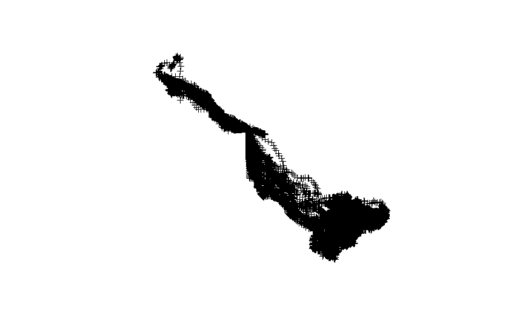
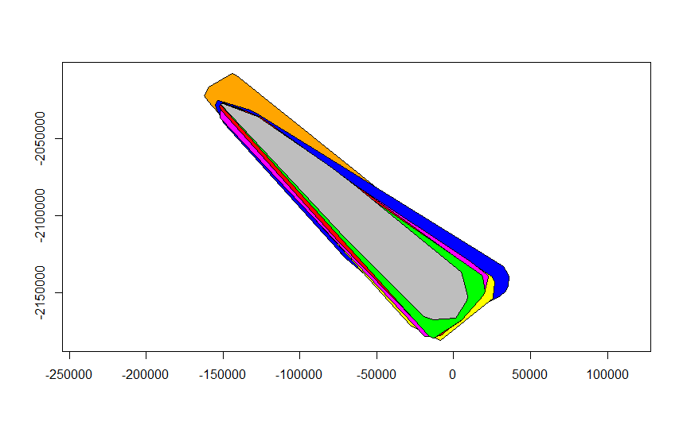
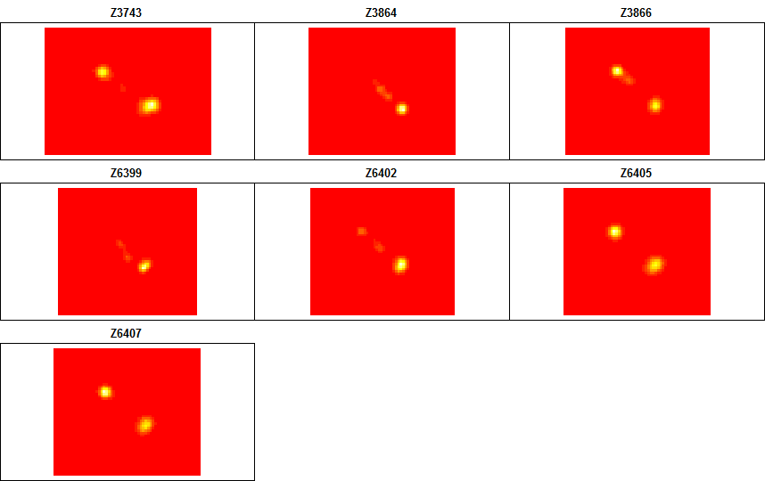
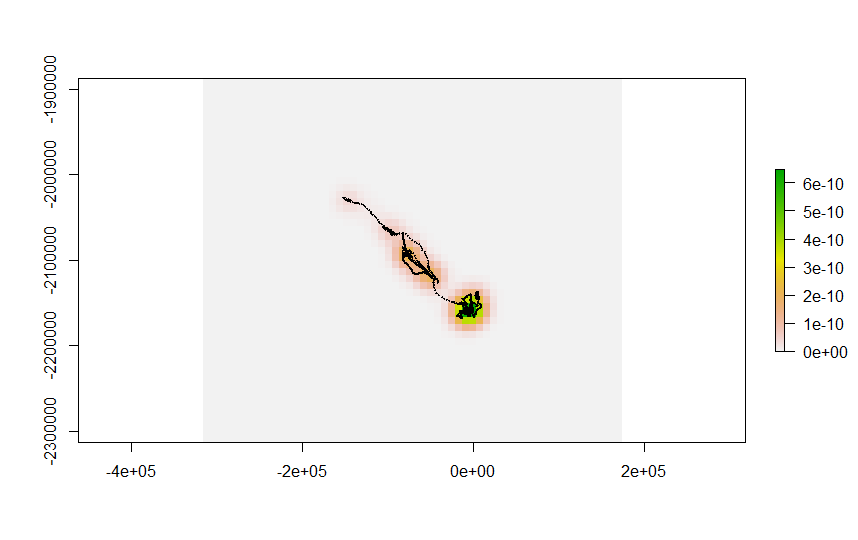
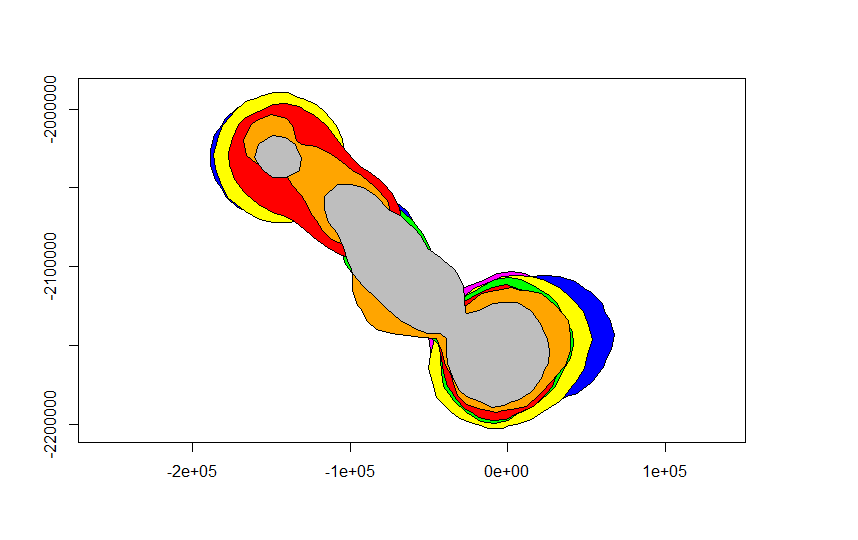
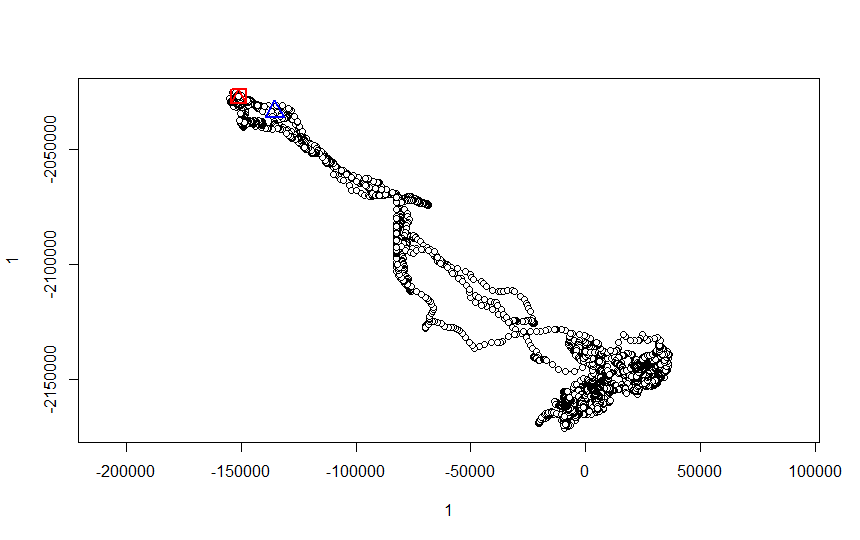
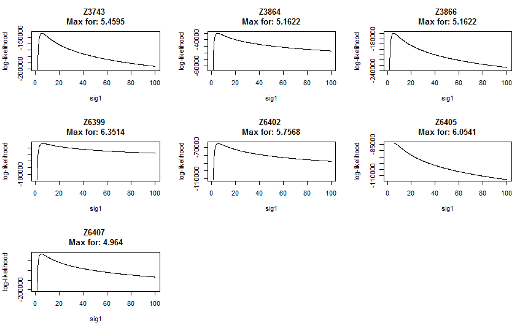
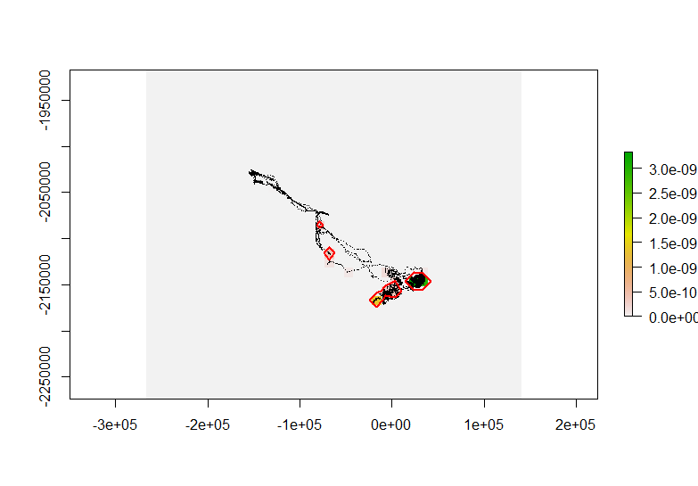

*This document, with active hyperlinks, is available online at:[https://github.com/mltConsEcol/TU_LandscapeAnalysis_Documents/blob/master/Assignments/Lab9_AnimalMovement.Rmd](https://github.com/mltConsEcol/TU_LandscapeAnalysis_Documents/blob/master/Assignments/Lab9_AnimalMovement.Rmd)*

**Due Date: Thursday, 9 April 2015**

***PLEASE WRITE YOUR NAME ON YOUR ANSWER DOCUMENT***

#Questions

1) Calculate the 50% Minimum Convex Polygon. Which individuals have the largest and smallest home range by this metric? Was it the same as for the 95% Minimum Convex Polygon (presented in the lab hand-out)?

2) Look at the points for a single individual on a map (you can do this in R or QGIS). Do you think the 95% Minimum Convex Polygon adequately descrbies the home range? Or do you think it characterizes it too broadly or too small? (Describe why)

3) Now look at a 95% Kernel Density Estimate with h="href" of the zebras' home ranges. Does this fit better or worse than the Minimum ConVex Polygon (justify your answer)

4) With Kernel Density Estimates, vary the bandwidth among 50, 500, 5000, and 50,000. Based on looking at the rasters, what happens to the home range as you increase the bandwidth? What value appears to be the most over-smoothed? [For the largest values, it may take a couple of minutes - just be patient.]

5) As you did for questions 2 and 3, look at home range estimate based on the 95% probbaility surface of the Brownian Bridge Movement Model. How does this appear to fit compared to the others? Explain your answer.

6) Given the migration pattern that is discernable, you could develop multiple home range estimates for different times of year. How might this inform conservation or management of this species (or any widely-ranging species in general?)

7) Plot the home range for zebra 'Z3743' with 100% of the density survace considered as the home range (the example in this handout uses 95%). Paste the plot in your answer document.

8) Which of the Brownian Bridge Movement Model home range estimates seems more reasonable or accurate - boundaries for 95% or 100% of the modeled surface? If you were looking to conserve the animal's habitat, which would you use?

9) Plot the trajectory for an individual zebra of your choice - circle the area of the path that appears to have the lowest tortuosity and lowest fractal index.

10) Describe a factor that might cause some individuals to have larger home range sizes than others within the same population of animals. Your answer can focus on a species of your choice, but should relate to the biology or ecology of the species.


#Introduction

As we covered in lecture, analysis of animal movement data is a broad topic, encompassing quantification of individual home ranges, characterizing movement patterns, and analyzing resource selection. In this lab we'll work with a dataset of GPS-telemetered zebras from Botswana to estimate home ranges. These data are available from [Movebank](https://www.movebank.org/), and are associated with a published paper: 
  
[Bartlam-Brooks, H. L. A., P. S. A. Beck, G. Bohrer, and S. Harris. 2013. In search of greener pastures: Using satellite images to predict the effects of environmental change on zebra migration. *Journal of Geophysical Research: Biogeosciences* 118:1427-1437.](http://onlinelibrary.wiley.com/doi/10.1002/jgrg.20096/abstract)
  
You can download the data as a CSV file at [https://www.datarepository.movebank.org/handle/10255/move.343](https://www.datarepository.movebank.org/handle/10255/move.343). (Note: The data downloads without a file extension. Simply right click on the file, select "rename" and add ".csv" to the file name.) The associated 'README.txt' file contains the metadata for the dataset, describing all fields. Though we'll be working with these data in R, you can also import them into QGIS (or other GIS software) for visualization and analysis.

In working through this lab, you should be aware that the dataset includes a long migratory path of zebras in Botswana, along with sites at the ends of the path, which serve for longer-term use (in the north and south).

In this lab we'll need the following packages:

* [adehabitatHR](http://cran.r-project.org/web/packages/adehabitatHR/index.html)
* [rgdal](http://cran.r-project.org/web/packages/rgdal/index.html)
* [raster](http://cran.r-project.org/web/packages/raster/index.html)


Though this lab goes through steps to import and set up data for these analyses, I recommend looking at the documentation for the and adehabitatHR packages - if you go to the package websites, you will find vignettes that work through lots of available functions (in addition to the ones covered here).


#Import Data and Prepare for Analyses

We will import the data for analyses, remove any potential problem points, and set them up as a SpatialPointsDataFrame object.

From looking at the metadata (the aforementioned README.txt file), we can see that there is a field in the dataset identifying points that were manually detected as outliers by the authors. Thus, after importing the data to R we will exclude those points. Furthermore, the data has some redundant and unnecessary fields, so we will take a subset of the columns. 


```{r, tidy=TRUE, eval=FALSE}
#Set working directory with 'setwd(...)'

#Import the csv file
zebra <- read.csv("Migratory.csv")

#Remove manually identified outliers (where 'manually.marked.outlier' is 'true' (Note- upon Import R changes 'TRUE' to lowercase, as TRUE has a specific logical meaning in R)
zebra <- subset(zebra, manually.marked.outlier != "true")

#Reduce the columns to only ones that might be useful - we don't need a lot of the data that came with the dataset
#We'll keep the "Event ID" - row identifier; "individual.local.identifier" as an animal ID number; "timestamp" as the date/time; and the coordinate fields
zebra <- zebra[,c("event.id", "visible", "individual.local.identifier", "timestamp", "location.long", "location.lat", "utm.easting", "utm.northing", "utm.zone")]
```

One thing we'll need to do for some analyses is is define the date/time field as something that R sees as a  date/time. When such data are imported into R, the program simply sees them as a Factors . There are multiple ways to deal with dates and times in R; we'll work with a fairly standard computing format, POSIXct. We will simpy re-define the timestamp field in the dataset to this (using 'as.POSIXct'), so R recognizes it appropriately. 

One extra step we need to do is clarify the way the time is set up to R (i.e., how the date and time fields are arranged within the 'timestamp' column). Fortunately, the format as this information came is almost completely set up in POSIXct format, though the time has fractional seconds (i.e., decimal seconds) which are unnecessary for our purposes. POSIXct should be able to handle decimal seconds, but they seem to be cause problems in this case. Thus, we will clarify for R how the data are set up, using the 'strptime' function nested within the 'as.POSIXct' function.

```{r, tidy=TRUE, eval=FALSE}
zebra$timestamp <- as.POSIXct(strptime(zebra$timestamp, "%Y-%m-%d %H:%M:%S"))


##The below line should normally work, but the values for decimal seconds (which are all 0) seem to cause problems, so we use the above code, with the strptime function included
#zebra$timestamp <- as.POSIXct(zebra$timestamp)
```

By default the time is considered in the time zone that your computer is set to (for me it is "Central Daylight Time" (or "CDT")). That is fine for this work. ALternative time zones can be specified in the 'as.POSIXct' function, albeit the specifics for setting format will depend on operating system. Working with date/time fields in R is a broad topic. You can see a list of packages that are useful for working with time series data at [http://cran.r-project.org/web/views/TimeSeries.html](http://cran.r-project.org/web/views/TimeSeries.html). There are lots of great tutorials, as seen at [http://www.stat.berkeley.edu/~s133/dates.html](http://www.stat.berkeley.edu/~s133/dates.html) and [http://www.noamross.net/blog/2014/2/10/using-times-and-dates-in-r---presentation-code.html](http://www.noamross.net/blog/2014/2/10/using-times-and-dates-in-r---presentation-code.html).

Next, we can set up a SpatialPointsDataFrame. We will copy the zebra dataset as a new object, which we will work from for this step. 

One potential problem we can run into is if there is no data for specific time points (perhaps good satellite reception was not available). SpatialPointsDataFrames must have x and y coordinates of some sort for all entries (i.e, there cannot be NoData values when entering coordinates). We can check for this by simply run the summary command on the entire dataset - it will give the number of NA values for each field, along with the summary statistics. There are also other ways you may find  by googling, to identify NA values, or count the number of NAs for a given field.

```{r, tidy=TRUE, eval=FALSE}
#Copy zebra object to another (zebra.spdf), which we will work with for this step.
zebra.spdf <- zebra

#Look at summary of dataset - especially the coordinates fields, to see if there are NA values
summary(zebra.spdf)
```

We can see there are 17 entries with NA values for each of the coordinate fields (location.long, location.lat, utm.easting, and utm.northing). We can identify which rows have the NA values for these fields using the 'which' function. The 'is.na' function that is shown nested is identifying rows where the values for the specified columns are NA, and whe 'which' function identifies those rows.

```{r, tidy=TRUE, eval=FALSE}
which(is.na(zebra.spdf$location.lat))
which(is.na(zebra.spdf$location.long))

##Note: if you wanted to find which rows had a specific value, instead of NA, you would remove the 'is.na' function, and use a logical operator at the end, followed by a specific value:
#which(zebra.spdf$location.long == [enter value here])
```

A quick look at the results shows the NA values are in the same rows for all of these fields. Thus, we can simply remove rows where one of the coordinate columns has an NA value.

These Latitude/Longitude and UTM coordinates are likely derived from one another, and NA values are in the same rows for all of these fields. To remove rows the NA values, we could do a subset with the 'subset' function. An alternative way of doing this is shown below, using similar syntax as we used to identify rows that had NA values. Note - there are also a handful of timestamps with NA values - it is not clear why that is, but we will also remove those to avoid problems later on.

```{r, tidy=TRUE, eval=FALSE}
#Remove rows with NA for 'location.long' column
zebra.spdf <- zebra.spdf[!is.na(zebra.spdf$location.long),]

#Remove rows with NA for 'timestamp'
zebra.spdf <- zebra.spdf[!is.na(zebra.spdf$timestamp),]
```

The above code is specifying the subset based on row and column indices (i.e., which rows and columns we want or don't want). Thus, we want the 'zebra.spdf' data frame, with the rows (specified in brackets before the comma), '!is.na' (not NA) for the 'location.long' column. By not specifying any specific desired columns (after the comma), we will get all columns in zebra.spdf in our result.

If you look at the summary of 'zebra.spdf', another thing to notice is that there are multiple UTM zones in the dataset (there are values for zones 34S and 35S). UTM values will repeat across zones, so having data across multiple UTM zones can cause confusion. Luckily, other fields have the coordinates in latitude/longitude coordinates, so we will just use those. Otherwise, we would need to create spatial objects based on subsets of the data (one subset for each UTM zone), transform the data into another projection, and then join them back together.

Finally, we are ready to convert this data to a SpatialPointsDataFrame - similar to as we have done in previous labs.

```{r, tidy=TRUE, eval=FALSE}
#There are three main arguments we are specifying: 
#The Coordinates (as longitude and latitude),
#the data that will go in the table (zebra.spdf), and the projection information

zebra.spdf <- SpatialPointsDataFrame(coords=as.data.frame(cbind(zebra.spdf$location.long,
      zebra.spdf$location.lat)), data=zebra.spdf, proj4string = 
        
    CRS("+proj=longlat +ellps=WGS84 +datum=WGS84 +no_defs"))


```

The data are in a degree-based coordinate system. One last thing we'll have to do is transform them to a meter-based coordinate system, for purposes of area calculations and such with home ranges. We will transform them to an Equal Area projection (based on a Lambert Conformal Conic - similar to Albers Equal Area for North America), using the 'spTransform' function

```{r, tidy=TRUE, eval=FALSE}
zebra.spdf <- spTransform(zebra.spdf,
                          
CRS("+proj=lcc +lat_1=20 +lat_2=-23 +lat_0=0 +lon_0=25 +x_0=0 +y_0=0
    +ellps=WGS84 +datum=WGS84 +units=m +no_defs"))

#You can plot the points as you would any other Spatial object
#it might take a minute as there are a lot of points
plot(zebra.spdf)
```
\


#Home Range Estimate

##Minimum Convex Polygon

With the data set up as a SpatialPointsDataFrame object, we are ready to analyze home ranges. We will start with basic Minimum Convex Polygons (MCPs). The function for this (in the 'adehabitatHR' package) is 'mcp'. The code below creates MCPs with all points, but you can easily adjust it to create MCPs with only a certain perceentage (e.g., 95%) of core points. 

```{r, tidy=TRUE, eval=FALSE}
#mcp will operate on a SpatialPoints Object or SpatialPointsDataFrame. FOr the former, it assumes the data are all for one individual; for the latter, you simply specify the SpatialPointsDataFrame and the field that identifies individuals, and MCPs are computed for each individual
#the "Percent" argument indicates what percentage of points you want to include.
#the 'unin' and unout arguments indicate what the spatial units of the input data are, and of the output area calculations, respectively.

#First: 100% MCP
zebra.mcp <- mcp(zebra.spdf[,"individual.local.identifier"], percent=100, unin="m", unout="km2")

#You can plot the home ranges - use the 'col' argument to specify colors for different individuals - there are 7 individuals tracked, so we can specify we want to use colors 1:7, based on standard R colors. You could customize this by specifying indivual colors (one per individual ID)
#add the argument 'axes=TRUE' to add x/y axes based on the data projection
plot(zebra.mcp, col=c(1:7)) 
#Custom-specified colors with axes
plot(zebra.mcp, col=c("blue", "gray", "red", "orange", "green", "yellow", "magenta"), axes=TRUE)
```

\

```{r, tidy=TRUE, eval=FALSE}

#The area of each home range is stored as a value in a table that gets created with the MCP output.
# You could call this table and view the results with either of the following, 
#and you could also assign the resulting table to a new object

zebra.mcp@data
as.data.frame(zebra.mcp)

#Output
#Notice - the ID and row name are the identifier codes for each individual.
         id     area
Z3743 Z3743 8822.359
Z3864 Z3864 5140.882
Z3866 Z3866 6738.416
Z6399 Z6399 9233.279
Z6402 Z6402 6137.580
Z6405 Z6405 7406.146
Z6407 Z6407 7326.553
```

##Output Shapefile 

You may wish to work with these outputs outside of R - you can output a shapefile with these polygons using a few different functions among different packages. My preferred is 'writeOGR' in the 'rgdal' package, as it outputs projection information, and is very customizeable. This works for points, polygons, and lines. Here is some example code:

```{r, tidy=TRUE, eval=FALSE}
#first argument is the name of the MCP object in R, the second is a folder name (to be created in the working directory), third argument is a name to assign the layer in the shapefile, and last argument is specifying what type of file to output the data as.
writeOGR(zebra.mcp, dsn="ZebraMCP100", layer="ZebraMCP100", driver='ESRI Shapefile')
```

##Kernel Density Estimate

Next, we will create a kernel density estimate of the home range for each individual zebra, using the 'kernelUD' fnction in the adehabitatHR package. We will start by simply using the 'href' bandwidth, as explained in class (specified in the argument 'h'), and we will simply use the bivariate normal (i.e., gausian) shape for the kernel. For your assignment, you will be expected to adjust the value for 'h' manually, simply by replacing '"href"' with various values. In your own work, you may  explore values calculated by least squares cross validatation (h="LSCV") as well, though that does not seem to work well for these data (It is possible the data are too heterogenous).

```{r, tidy=TRUE, eval=FALSE}
zebra.Khref <- kernelUD(zebra.spdf[,"individual.local.identifier"], h="href")

#You can plot the KDE for each individual separately:
image(zebra.Khref)
```

\

```{r, tidy=TRUE, eval=FALSE}
#You can convert the output to a 'raster' object for each individual. Demonstrated here for individual z3864. You can then output the raster to a file for use in other GIS software:
z3864KDE.rast <- (raster(as(zebra.Khref$Z3864, "SpatialPixelsDataFrame")))

#file gets saved to current working directory unless otherwise specified
writeRaster(z3864KDE.rast, "Z3864KDERast.tif") 

#Plot the raster on its own - note, color scheme is different for raster package than when you previously plotted it
plot(z3864KDE.rast) 

#You can subset the SpatialPointsDataFrame too, and plot the points for only that individual on top of the raster
z3864 <- zebra.spdf[zebra.spdf$individual.local.identifier=="Z3864",]
plot(z3864, add=T, cex=0.1) #use 'cex' to adjust the size; default is 1
```

\


With Kernel Density Estimates, home ranges are often characterized as a certain percentage of the entire density (e.g., 90% or 95%). Thus, we can extract these areas automatically using the function 'getverticeshr'.

```{r, tidy=TRUE, eval=FALSE}
zebra.KDE95 <- getverticeshr(zebra.Khref, percent=95)

plot(zebra.KDE95, col=c("blue", "gray", "red", "orange", "green", "yellow", "magenta"), axes=TRUE)
```

\


#Considering Paths of Animal Movement and Dealing with Temporal Autocorrelation

As discussed in class, temporal autocorrelation in location records can cause biased estimates of animals' home ranges. One technique that helps deal with this is by using a Brownian Bridge Movement Model, which estimate the probability of individuals moving to parts of the landscape along their paths between sequential points. 

To prepare data for this last home range analysis, we need to establish the trajectory of each animal, creating a 'ltraj' object using the 'as.ltraj' function. The timestamp will be used in this, as will the individual identifier and the coordinates. This object contains information on distance and angles traveled by individuals, from point to point through time.


```{r, tidy=TRUE, eval=FALSE}
zeb.traj <- as.ltraj(coordinates(zebra.spdf), date=zebra.spdf$timestamp
                     ,id=zebra.spdf$individual.local.identifier)

# View what this looks like
zeb.traj

*********** List of class ltraj ***********

Type of the traject: Type II (time recorded)
Irregular traject. Variable time lag between two locs

Characteristics of the bursts:
     id burst nb.reloc NAs          date.begin            date.end
1 Z3743 Z3743    10910   0 2007-10-28 00:00:24 2008-08-28 09:00:41
2 Z3864 Z3864     2720   0 2007-10-25 00:02:11 2008-01-05 04:30:06
3 Z3866 Z3866    13044   0 2007-10-25 08:01:53 2008-10-22 23:00:45
4 Z6399 Z6399     6388   0 2008-10-24 09:01:48 2009-06-01 15:00:08
5 Z6402 Z6402     4837   0 2008-10-24 07:00:42 2009-04-21 07:00:37
6 Z6405 Z6405     6193   0 2008-08-27 05:00:44 2009-03-31 19:00:19
7 Z6407 Z6407     9679   0 2008-08-27 08:01:17 2009-05-27 12:00:38


 infolocs provided. The following variables are available:
[1] "pkey"


#You can plot the trajectory for each individual - the numbers correspond to the ID in the zeb.traj object above
plot(zeb.traj[1])
```

Here is a plot of a sample trajectory for individual Z3743. The points highlithed in blue and red are the start and end points. 

\

The Brownian movement model requires input of some parameters. 

  * sig1: a first smoothing parameter related to the speed of animals
  * sig2: a second smoothing parameter related to imprecision of the location data.
  
The second may be known or estimated (it is not available in the metadata, but for purposes of this lab, we'll estimate 5 meters). The first, however, can be directly estimated from the data using a maximum likelihood estimate with the 'liker' function. This requires that we provide a range of potential estimates for sig1, 'rangesig1'.

```{r, tidy=TRUE, eval=FALSE}
likZeb <- liker(zeb.traj, sig2=5, rangesig1=c(1,100))
```

After running the above command, you will see a series of plots, like the one below, with one graph per zebra. If there is no clear peak, you may need to adjust the 'rangesig1' values and try again (if the curves simply look like downward slopes, try smaller values). We are seeking the value for sig1 (presented on x-axes), that the log-likelihood is maximized. The optimal values from each are indicated above each plot.

\

We can now model the home ranges using the Brownian Bridge Movement Model, using the respective sig1 values for each individual. The function for this is 'kernelbb'. We will enter the sig1 values as a list after the argument 'sig1':

This may take some time to run. If you only want to run the model for one individual at a time, you can specify the individual (corresponding to the order of individuals in the ltraj object), in brackets after the name of the ltraj object you are operating on, as shown below. Furthermore, you can do the other raster and vector operations as described for the KDE, including extracting a home range based on a specified amount of the probability distribution.


```{r, tidy=TRUE, eval=FALSE}
#This works on all individuals at once
zeb.bb <- kernelbb(zeb.traj, sig1 = c(5.45, 5.16, 5.16, 6.35, 5.76,6.05, 4.95), sig2 = 5)

#This next line (commented out) works on the first individual (denoted by the [1]); a list of individuals could be specified using as '[c(1,3,5)]'
zeb.bb.1 <- kernelbb(zeb.traj[1], sig1 = 5.45, sig2 = 5)

#Again, you can plot the modeled home range as with the Kernel Density Estimates.
image(zeb.bb)

#And you can make it into it's own raster object, to write it to an external file, etc.
z3743BB <- (raster(as(zeb.bb$Z3743, "SpatialPixelsDataFrame")))

#Plot the individual raster
plot(z3743BB)

#Extract the points for only individual Z3743
z3743 <- zebra.spdf[zebra.spdf$individual.local.identifier=="Z3743",]

#Plot those points on the raster
plot(z3743, add=TRUE, cex=0.01)

#Get boundaries of 95% probability surface for a home range estimate
zebBB.95 <- getverticeshr(zeb.bb, 95, unout="km2")

#Plot the bounds for the first individual (Z3743)
plot(zebBB.95[1,], border="red", lwd=2, add=TRUE)
#Row index for zebBB.95 goes the data table for it (see below)
```

\


As with the prevous home range estimators, you can also extract the area of the specified home range for the Brownian Bridge Movement Model based at the desired level (we will use the 95% level again):

```{r, tidy=TRUE, eval=FALSE}
zebBB.95@data

         id     area
Z3743 Z3743 854.2538
Z3864 Z3864 413.4430
Z3866 Z3866 882.7497
Z6399 Z6399 800.7530
Z6402 Z6402 447.2395
Z6405 Z6405 227.7925
Z6407 Z6407 802.5783
```


#Final Notes

Animal movement is an incredibly broad field. The techniques covered here for estimating home range size are some of the more common ones, but others exist. Furthermore, there are numerous metrics for quantifying paths that individuals follow, estimating permeability of the landscape for individuals (i.e, how easiy is it for an animal to move throuh the landscape), and quantifying selection of resources. Definitely look into the primary literature (discussed in part during lecture) as you more forward on your own. In R, the suite of adehabitat packages (adehabitatHR, adehabitatLT, adehabitatMA, and adehabitatHS) are very powerful and well-documented, though don't be afraid to try new techniques and programs as they become available, expanding your tool-kit as you proceed.
