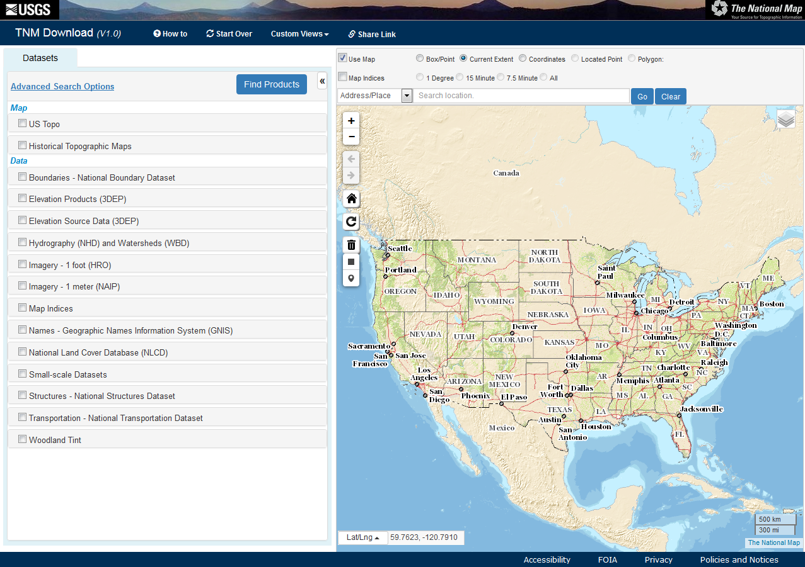
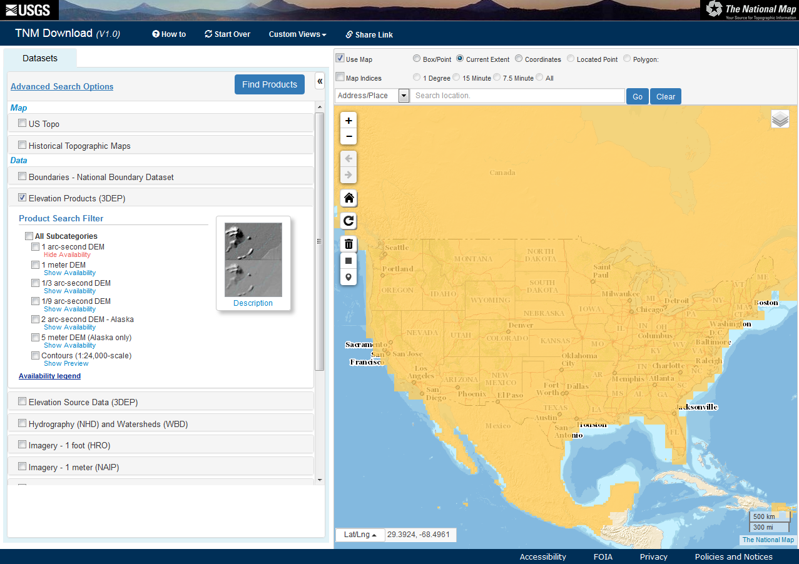
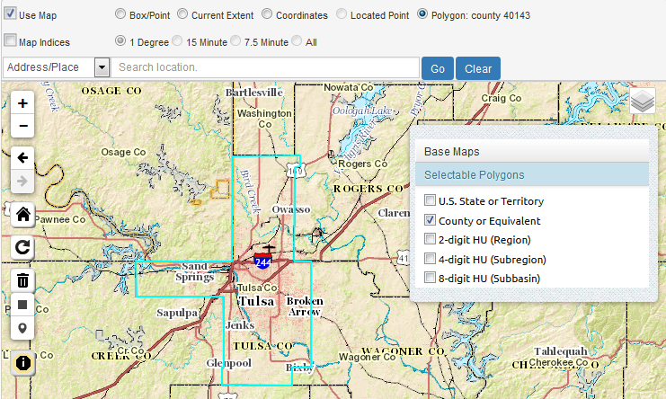
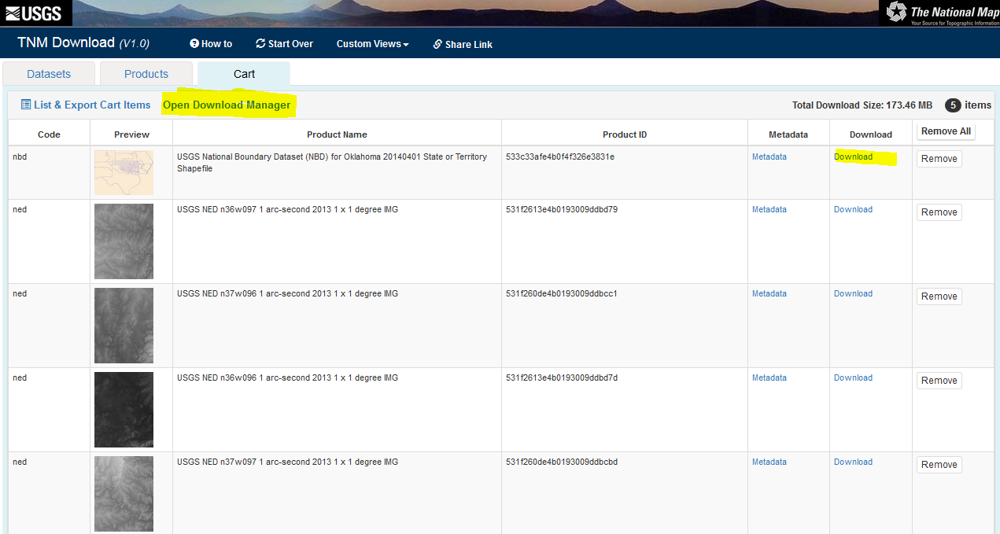
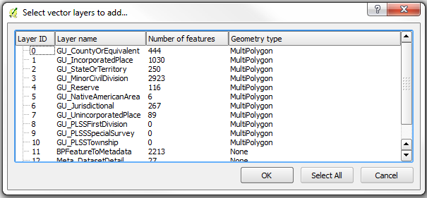
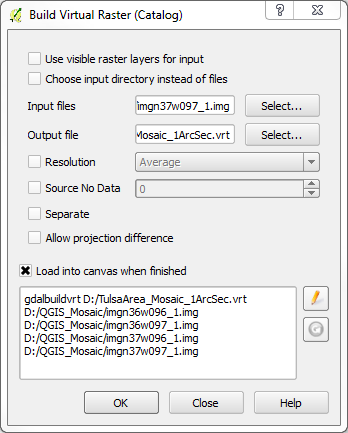

*Note: This material is available online with active hyperlinks at [http://mltconsecol.github.io/TU_LandscapeAnalysis_Documents/Assignments_web/Assignment02_AccessingGISData.html](http://mltconsecol.github.io/TU_LandscapeAnalysis_Documents/Assignments_web/Assignment02_AccessingGISData.html)

# Accessing Ecologically-relevant GIS Datasets

Though many studies use various spatial/GIS datasets, finding and working with them can be a bit of a mystery to a GIS newcomer. This document is designed to point users in the right direction to get started, with a focus on the United States (though some datasets discussed here are also available for other parts of the world). The resources listed below are not necessarily mutually-exclusive to one-another (i.e, you can often find some of the same datasets at multiple places), though some datasets may only be available from individual sources. Detailed instructions on downloading the data are given for the first source to familiarize users with data downloads, but they should explore the other websites to try and figure out how to access the data there - unfortunately every website is a bit different. Typically the projection information is provided and will be read by your GIS software, but if it is not, you may need to look into metadata that comes with the files. This document is meant to get users started, and is thus not to serve as a comprehensive manual for accessing every data source available. Remember - Google is your friend. If it helps, start at these websites to look for datasets you need; if you can't find them, they may exist, but that might require some web-searches. Also, internet Q&A outlets like [GIS Stack Exchange](http://gis.stackexchange.com/) are invaluable when you really get stuck.

## The National Map

[The National Map](http://nationalmap.gov/) is kind of a one-stop-shopping location for lots of datasets that are distributed by the U.S. Government. These include vector layers of political boundaries, hydrologic data including stream networks and watershed boundaries from the [National Hydrography Dataset](http://nhd.usgs.gov/), and roads. These layers are typically available for download as shapefiles or geodatabase files. Raster datasets that are available include elevation (digital elevation models [DEMs]) from the [National Elevation Dataset](http://ned.usgs.gov/), land cover classifications from the [National Land Cover Database](http://www.mrlc.gov/), and aerial imagery.

The National Map has lots of ways to view and download data, with semi-regular improvements. You should take some time and explore [The National Map website](http://nationalmap.gov/) for yourself, but a good way to see what is available is through the Data Download and Visualization Services - The National Map Download Platform - [http://viewer.nationalmap.gov/basic/](http://viewer.nationalmap.gov/basic/) (pictured below).

\

On the left hand panel, you will see a list of existing maps and types of data that might be avaialble for areas of the United States. The *Map* categories are provided as PDFs or GeoPDFs, and are ready to print or use in the field. The *Data* categories are GIS files, that can be brought into QGIS (or other GIS software) for manipulation, analysis, and visualization. In the map area, you can use the icons and your mouse scroll-wheel to zoom in/out, and click and drag to pan the map area in view. If you hold the mouse over specific icons in the map area, text will appear to define what these icons do.

Upon clicking on a check-box in the left pane, that section will expand, with subsequent checkboxes for different data types and file formats. For each data type, you can click the "Show Availability" link, which will shade the map view to indicate areas for which the specified data are available. Below is what it looks like when showing the availability for 1 arc-second Digital Elevation Models (DEM), which have ~90 m pixels.

\

### Downloading Data from The National Map

If you check one of the boxes of a specific data type, and select a format, you can click the "Find Products" button to see what is available for an area (by default, the viewable map area). A new tab will open, showing the avaialble Products (you can click on the 'Datasets' tab to return to the original view with dataset options. Large datasets such as Digital Elevation Models are 'tiled' for download (i.e., broken into lots of smaller pieces that can be 'mosaiced' back together). Thus, if you look at the available products for the continental U.S. for the 1 arc-second DEM, we will see hundreds or thousands of available data products. For such broad-scale projects, it is worth considering lower-resolution data (with large pixels) and exploring alternative, albeit often less user-friendly download options. 

For this exercise, we will just download data for the Tulsa County. You can zoom into the area around Tulsa (or use the Address/Place Search). Then, in the top-right of the map, click the 'layers' icon . This will show the desired resolution of boundaries available for display and selection directly on the map. U.S. State/Territory and County or Equivalent options should be fairly intuitive, though the 'HU' areas may not be. 'HU' stands for Hydrologic Unit, which is associated with the National Hydrography Dataset. You can click the 'County or Equivalent', and you will then see the county boundaries depicted on the map. Clicking in the area of Tulsa County should select that area, indicated by an outline in a light-blue color.

\

Using the options at the top (e.g., Box/Point, Current Extent, etc), you can change the area that the website will focus on for data availability queries and downloads.

Now, we will do a query for Boundaries from the National Boundary Dataset (looking for Shapefiles) and Elevation Products from the 3DEP program (looking for IMG files), as in the image below. Once the appropriate options are selected, click the 'Find Products' button.

\

The results will then appear - you will see three results for the Boundaries data all you need is the dataset for Oklahoma.  Click the  to add it to your list of desired downloads. Note you can click the appropriate icons to view the Footprint of the data, view the metadata, and even direclty download it immediately. Note, this product will have state boundaries, as well as smaller jurisdictions such as Counties. The layers will have shapes included for adjacent areas in other states, but we can remove these in various ways using GIS tools.

For the Elevation Products, viewing the Footprints and Thumbnails reveal that each of the tiles only covers a portion of Tulsa County. Thus, we need to add all four of the tiles to the cart. We can then click the 'View Cart' button, and in the next page, either click individual download links, or use the 'Open Downlaod Manager' link at the top of the screen.  The download manager relies on Java, which opens up another small program, but is convenient if you are downloading lots of layers. You can go back to the dataset search and products selection windows as needed using the tabs near the top of the page.

\

Upon clicking the Download links, downloads will begin. If given the option to open the files or save them, choose the option to save the datasets. 

*Note that the different datasets have certain naming conventions. For example, the title for the 1 arc-second Digital Elevation Models is something along the lines of this: "USGS NED n36w097 1 arc-second 2013 1 x 1 degree IMG". 'USGS NED' indicates these data are part of the USGS National Elevation Dataset.  The 'n36w097' indicates the upper left corner is at 36 degrees latitude, -97 degrees longitude. '1 arc-second 2013' indicates the resolution (pixel size) and year of the data, the '1 x 1 degree' indicates the size of the tile, and the 'IMG' indicates the format.*

### USDA GIS Resources

The [USDA Geospatial Gateway](http://datagateway.nrcs.usda.gov/) also has a wide variety of data available for download, including soil data, and high resolution aerial imagery. To get started, go to the [website](http://datagateway.nrcs.usda.gov/) and click the green "Get Data" button (towards the upper-right). 

From there, you'll need to select the desired State/County of interest, and the datasets you need. see the panes on the left of the screen that describe each step, as in the example below). Note, this website has available Climate data from PRISM, further described below.

\

## State GIS Resources (for Oklahoma)

Most states have their own repositories for GIS data. Typically when I'm trying to find such a repository, I do a Google search for something along the lines of these phrases: "[Insert State Name] GIS Data"; "[Insert State Name] GIS Repository"; "[Insert State Name] GIS Warehouse"; or "[Insert State Name] GIS Clearinghouse". Here are also a couple of websites that list some resources available by state:

* [Tulsa City-County Library GIS resources](http://guides.tulsalibrary.org/content.php?pid=557423&sid=4599537)
* [Carleton College webpage from theNational Association of Geoscience Teachers](http://serc.carleton.edu/NAGTWorkshops/gis/state_resources.html)

For Oklahoma, a couple of particular websites that can be useful are:

* [The OKMaps Website](http://ogi.state.ok.us/ogi/search.aspx)
* [Center for Spatial Analysis at the University of Oklahoma](http://geo.ou.edu/DataFrame.htm)

## Climate Data

Climate data are typically recorded at individual weather stations, though in ecological studies, it is typically useful to have summaries of climate conditions for entire landscapes, describing characteristics of temperature and precipitation regimes. Thus, multiple organizations have interpolated the data from weather stations, to estimate conditions for large areas. There are two main sources I frequently go to, listed below. Browse the respective website for information on downloading the data. If you need information from a specific weather station, you can search the resources from the [NOAA National Climatic Data Center](http://www.ncdc.noaa.gov/data-access/land-based-station-data). Other sources may be available from state-wide monitoring networks (e.g., [Mesonet for Oklahoma](https://www.mesonet.org/) and other organizations.

* [PRISM Climate Group at Oregon State](http://www.prism.oregonstate.edu/)
	* Has 800 meter pixel data for the continental United States
	* Lots of information, including 30 year normals for monthly and annual precipitation, maximum temperature, and minimum temperature.
	* Also has elevation layers, historical data, and recent data for individual months
* [WorldClim Global Climate Data](http://www.worldclim.org/) 
	* Global Dataset of 30 second resolution (~800-1,000 meter resolution); Coarser resolutions are available (which are smaller file size)
	* Monthly and annual minimum, maximum, and mean temperature and precipitation
	* Also contains "Bioclim" layers - described [here](http://www.worldclim.org/bioclim)
		* These layers are derived from monthly precipitation and temperature data, to describe the climate in biologically meaningful ways.
	* Datasets include current conditions (based on 50 year average), projected future conditions under various climate change scenarios, and historical conditions.

	
## Some Notes About Working Downloaded Data

### Uncompressing Data

GIS datasets tend to  be fairly large, thus they often come in compressed formats. For files compressed into a '.zip' file, you can simply use the utility that came with your operating system (in Windows, you could just right-click on the .zip file, and select "Extract All".

Another compressed format you may encounter is or 'tar.gz', for which special software is generally required. [7zip](http://www.7-zip.org/) is a free, powerful tool for dealing with compressed files in Windows. If you check out the [download](http://www.7-zip.org/download.html) page, there are some options listed for Mac and Linux systems (scroll to the bottom). For Windows machines, simply download and run the appropriate installer (32 bit or 64 bit, depending on your system; version 15.14 is the current standard version.

After installing 7-zip, you should see options to work with files in 7-zip when you right-click on them (as shown below; if not, you can find 7-zip in your programs, open the software, browse to your appropriate .tar.gz file, and use the extract functions as described hereafter).  In the example below, the compressed file is 'builtupp_usa.shp_nt00899.tar.gz', and we start by extracting it to a the current directory.

\

The resulting file will end in '.tar' Now you need to do one more de-compression step - right click on the .tar file, select 7-zip, and 'Extract to "[Filename]"'. This should create a new folder, with all of the files that were in the compressed folder.

### Dealing with ESRI Geodatabases in QGIS (tested with version 2.12.2)

Some GIS data may only be available in a format developed by the company that makes ArcGIS (ESRI), called ESRI Geodatabases (ESRI .GDB files). Typically they are used for vector datasets. There are some extra steps in importing these into QGIS:

* \  Click on the "Add Vector Layer" icon.

* In the window that pops up, choose the source-type as "Directory", leave the Encoding set to the default, and change the source to "OpenFileGDB" (see the example window below).

* Then, click "Browse",  find and select folder ending in '.gdb', where the data are stored (in the example given here, it is the state boundary dataset for Arkansas, downloaded from The National Map), and click "Open".

\

* Another window will now appear, with a list of layers in this geodatabase. You can look at the "Geometry Type" to identify whether the layer is composed of lines, polygons, or points. If no geometry type is identified, the layer may be a table or metadata. You can use "Select All" to load all layers - this may be a lot of information though, so if there are a lot of layers and a large area, you can look at one layer at a time.

\

* You cannot edit these layers while they are in .gdb files, but you can export them to Shapefiles, and conduct any manipulations/analyses with that format.
	* Right click on the layer you need to work with in the Layers Pane of QGIS, and selct "Save As".
	* Keep the Format as ESRI Shapefile and define a filename and location in the "Save As" box. The defaults should work for most purposes. The defaults should load the new Shapefile into your current project, but you can also use standard data import methods to bring the data into QGIS.
	

### Removing Unwanted Features from Vector Layers (e.g., isolating a single county of interest)

Vector datasets may be available for larger areas than you really want - for example, if you want to work with Tulsa County, Oklahoma, and you download the appropriate layer from The National Map, the layer you have will likely include all counties of Oklahoma (and adjacent counties in neighboring states).

\

One way, described below, is to do a query on (i.e., filter out) the layer to show only the desired features, based on the Attribute Table. Alternatively, you may make a copy of the shapefile, use the layer editing tools to delete features. Here are instructions for the former option, with an example from the "County or Equivalent" layer for Oklahoma, to only display Tulsa County:

* Right-click the focal layer and select "Properties"
* Along the left side of the Properties window, select the "General" tab.
* Make sure the "Feature subset" section is open by clicking the arrow next to that text, and click the "Query Builder" button (see screen-shot below).

\

* In the next window that appears, there will be an area that says "Fields" - these are the columns in the Attribute Table for the layer. The field "County_NAM" contains the full names of counties. An example of the window filled as necessary is provided after this section.
	* If you click a field name, and in the Values box click either "Sample" or "All", either a random sample or all of the possible values for the selected attribute will be displayed. So, if you select "COUNTY_NAM" and then click "All", you will see all of the county names listed.
* Double-click the name of the field you wish to filter the data by, and it will appear in the white box towards the bottom of this window.  Then select the appropriate operator you wish to use. 
	* In this case, we wish to select only Counties where the "COUNTY_NAM" is "Tulsa", so choose the "=" button. If you wanted all counties except for Tulsa, you would use the "!=" button.
	* Then type " 'Tulsa' " (or double-click on "Tulsa" in list of Values).
* If you click "Test" with these settings, it should tell you "The where clause returned 1 row(s).", meaning that only one feature in the dataset will be used (i.e., Tulsa County).
* Click "OK", then Click "OK" again in the Properties window, and now Tulsa County is the only area displayed.
* If you need to un-do this, simply get back into the Query Builder window, and use the "Clear" button towards the bottom.

\

	
And here's what the result should look like:

\
 

### Mosaicing Rasters

As we saw with the 1 arc-second Digital Elevation Models for Tulsa, a desired dataset might only be available in tiles, which individually do not cover a focal study area. This can be dealt with in a couple of ways using QGIS. First, you can 'mosaic' the tiles, which is basically like stitching them together and creating a new layer. Second, you can create a 'Virtual Raster Catalogue', which basically knows where the original tiles are stored, and referencs them to make them appear as a single file. Both techniques are effective, but the former requires the computer to work with more data in memory, for a larger area, and computation time. The latter option is very quick, but you must be sure to keep track of the files and maintain the same relative paths for the original files if you move them around on your computer.

In QGIS, both of these options are reached through the Raster menu (from the Menu Bar), with 'Merge' and 'Build Virtual Raster (Catalogue)'. It is easiest if the individual tiles are in a single folder together. The tiles do not need to be opened in QGIS to perform the operations, but they can be.

\

To mosaic the tiles and create a new file, you will choose 'Merge'. Then, select the Input files and specify an output file location. You can leave the defaults, and click 'OK'. (See the example dialogue box below.) The output will appear in QGIS upon completion (it will take some procesing time). The underlying tool being used is called 'GDAL Merge' - you can read about the options you may adjust in the dialogue box for this operation at [http://www.gdal.org/gdal_merge.html](http://www.gdal.org/gdal_merge.html).

\

To build a virtual raster of the tiles, which will display as a single layer, you will choose 'Build Virtual Raster (Catalogue)...' instead of 'Merge'. If you have the layers in QGIS already, you can simply specify "Use visible raster layers for input", but if not, choose the input files manually. Again, specify the output file, and you can leave the default options for now (see below for a sample filled-in dialogue box). Again, the process should run quickly, with the result displayed in the main QGIS window. The underlying tool being used is called 'GDAL Build VRT' - you can read about the options you may adjust in the dialogue box for this operation at [http://www.gdal.org/gdalbuildvrt.html](http://www.gdal.org/gdalbuildvrt.html).

\

### Spatial Reference Information for GIS Data Layers

When you load data into a GIS program, the projection information should automatically be interpreted by the software, if it is stored correctly with the appropriate files. If the projection information is not automatically loaded, you may need to look through metadata files that come with the data (often stored in '.xml' or '.html' documents, ideally labelled as 'metadata'). If you find the projection you can then set it in your GIS software.
