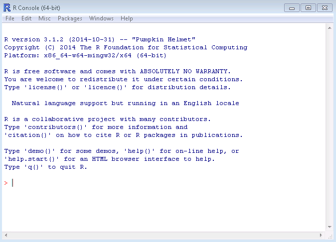

*This document is available online, with active hyperlinks, at: [http://mltconsecol.github.io/TU_LandscapeAnalysis_Documents/Assignments_web/Assignment02_IntroToR.html](http://mltconsecol.github.io/TU_LandscapeAnalysis_Documents/Assignments_web/Assignment02_IntroToR.html)*


[R](http://www.r-project.org/) is a powerful, free platform for statistical computing, and has become commonly employed in countless fields in the last decade. It is largely command-line driven, however, which creates a steep learning curve. This document and the contained exercises are designed to give new users some familiarity with the program, which we will build upon throughout the course. Users can interface directly with R, or work with [RStudio](http://www.rstudio.com/), which some people find makes it easier to stay organized within a session of R.

To install R on your own computer, look for the download links here: [http://cran.r-project.org/](http://cran.r-project.org/), and follow the respective instructions. To install RStudio, find the download button at the RStudio homepage, here: [http://www.rstudio.com/](http://www.rstudio.com/). We won't be using RStudio quite yet, but you can start looking into it if you're curious.

There are lots of good websites you might want to use as a reference.

* R Reference Card: [http://cran.r-project.org/doc/contrib/Short-refcard.pdf](http://cran.r-project.org/doc/contrib/Short-refcard.pdf)
    * There is an updated version at [http://cran.r-project.org/doc/contrib/Baggott-refcard-v2.pdf](http://cran.r-project.org/doc/contrib/Baggott-refcard-v2.pdf), but the first link may be slightly easier for beginners.
* The Quick-R Website [http://www.statmethods.net/](http://www.statmethods.net/)
* The UCLA Institute for Digitial Research and Education: [http://www.ats.ucla.edu/stat/r/](http://www.ats.ucla.edu/stat/r/)

In these exercises, feel free to use any resources at your fingertips. There are lots of great forums and websites, in addition the ones listed above, where people have asked and questions, across the spectrum from basic to complex. As a regular R user, I frequently Google issues that come up - it might take some sifting to figure out the results, but it generally works. Also, check out the help function of R, described later in this document.  

You may get errors from commands you type into R - try to interpret them on your own first and try to fix what might be wrong, but ask for help as needed. They can be admittedly somewhat cryptic, but the first step is to NOT PANIC. Then, read the error message, think, and Google/ask the instructor or a classmate.

## Getting Started with R

Start by opening up the lastest version of R installed on your computer. You'll see a screen that may look a bit daunting, with a single window that has text in it and a blinking cursor. It should look something like this: 


\


This is where you can type commands directly into R, and see immediately what R has done with your commands. There are two main ways to work with R:

1) Interactively, within this window; and 
2) Via scripting, using R Script files.

We'll focus on using R interactively for now, but for keeping track of work and repeatability, scripting is beneficial.

R is very powerful on its own, and there are countless packages that expand on its capabilities and make complex functions very simple. However, in it's simplest form, R can be used as a fancy, powerful calculator. Typing mathematical expressions will produce the correct result. For example, try some of the following commands (type them in the console and hit enter or return).


```{r, results='hide'}
3+5
5 * 3
15/3
factorial(5)
```

You can also 'assign' numbers to characters or names, and conduct calculations with those. The standard assignment operator is '<-'; '=' also works, but '<-' is preferred.

```{r, results='hide'}
a <- 5
b <- 3
a+b
a*b
```

Assignment is an important part of working in R, for defining variables, defining datasets, and defining functions (further down the road). For example, you can define a vector (a simple list of numbers) using an assignment. What the information is assigned to is generally arbitrary, and you can use whatever name in the assignment you want, though it cannot be a stand-alone number, and should not be something likely to be an existing function.

```{r, results='hide'}
vector1 <- c(1,2,5,8,2)
```

Once you have used the assignment operator, R has information loaded into memory. You can see what R has loaded into memory by using:

```{r, results='hide'}
ls()
```

Typing any item listed by that function will display that entire dataset.

Note that the 'c' before the list of numbers above is actually a function. So in this case, the function is being used to define the assignment (i.e, what is being called vector1). Functions precede opening parentheses, and have various arguments, depending on the specific function. To see specifics for a function, simply type help([function name]), as with this:

```{r, results='hide'}
help(c)
```

The help file may seem a bit elusive at first, but just read the description carefully - as you get more familiar with R, it will start to make some sense. Furthermore, help has useful examples at the end of each section - simply scroll down to the end of the help page for a specific function and you will find them.


To see what is actually stored as the character or name, simply type the assignment

```{r, results='hide'}
vector1
```

Furthermore, you can conduct mathematical operations on the assigned information, and get summary statistics. Try the following and see what happens:

```{r, results='hide'}
mean(vector1)
vector1 * 4
summary(vector1)
length(vector1)
```

*Question 1: What does the function 'length' do?*

You can work with multiple vectors together too  (try these and see what happens):

```{r, results='hide'}
vector2 <- c(3,4,2,6,9)
vector1 * vector2
vector1 / vector2
cor(vector1,vector2)
```

*Question 2: What does the function 'cor' do, and what value does it return in this case?*

To store the result of an operation as a new entity, simply use an assignment:

```{r, results='hide'}
vector3 <- vector1 * vector2
```
An important thing to be aware of is that data can be in various forms - it can be stored as integers, as strings (i.e, non-numerical characters), and factors (i.e., categories). You can define these yourself, though R has automatic interpretations. To figure out how R sees data, use the 'str' command (which stands for Structure). For example,

```{r, results='hide'}
str(vector1)
```

The result of that command should be 'num [1:5] 1 2 5 8 2'. If you are dealing with multiple variables in a dataset, as you will later in this exercise, the results will also list the variable names.

This indicates that it vector1 is numeric, contains 5 pieces of information (1 through 5), and lists the data. If it were a much longer vector, it would only list the first few pieces of information.

You can also plot data in various ways. For example, the simple commands 'boxplot([vector name]' and 'hist[vector name]' create boxplot and histograms respectively. 

You can also plot two variables together.

*Question 3: using the help for the function 'plot', produce a plot of the variables vector1 and vector2 together, and copy and paste it into your results.*

There are some datasets you can play around with, built into R. To see what they are, type the command below and hit enter/return.

```{r, results='hide'}
data()
```

Load the 'iris' dataset by typing

```{r, results='hide'}
data(iris)
```

You can view the beginning of the dataset (i.e, the first few rows) using the 'head' function, and the end of the dataset using the 'tail function'.  To view only a single column, you could use iris$[columnName]. You can also combine these, to view the beginning or end of a single variable in a dataset.

```{r, results='hide'}
head(iris$Sepal.Length)
```

*Note that spaces are not allowed in column names in R - they are replaced with periods. This is reflected when you view the dataset, and needs to be maintained when you use the data in functions.

Now work with this dataset to complete answer the remaining questions/complete the remaining tasks.

*Question 4: Inspect the structure of the iris dataset. What variable is recognized by R as a Factor variable?*
*Bonus Question: Can you figure out what categories exist for this factor variable?*

*Question 5: Make a histogram for Sepal Length, and paste it into your results. Here's a hint: to call on a single column of a dataset, you need to type 'datasetName$columnName'*

*Question 6: Use the 'subset' command to create a subset of the data, where the only species represented is 'setosa' (you can use 'head' and 'tail' to inspect the beginning and end of the resulting dataset, or view the entire result by simply typing the new name of the resulting dataset)*

*Question 7: For the entire iris dataset, calculate the correlation coefficient between Sepal Length and Petal Length.*

*Question 8: Plot the relationship between Sepal Length and Petal Length for the entire dataset. As an extra challenge, see if you can use symbols other than the default*

*Question 9: What is the maximum value for Petal Length across the entire dataset?*

*Question 10: For the subset of data that you took earlier (Question 6), create a boxplot of Sepal Width.*
