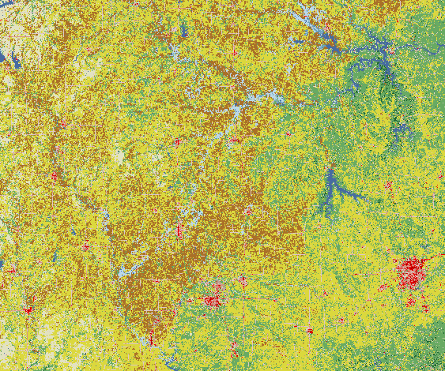
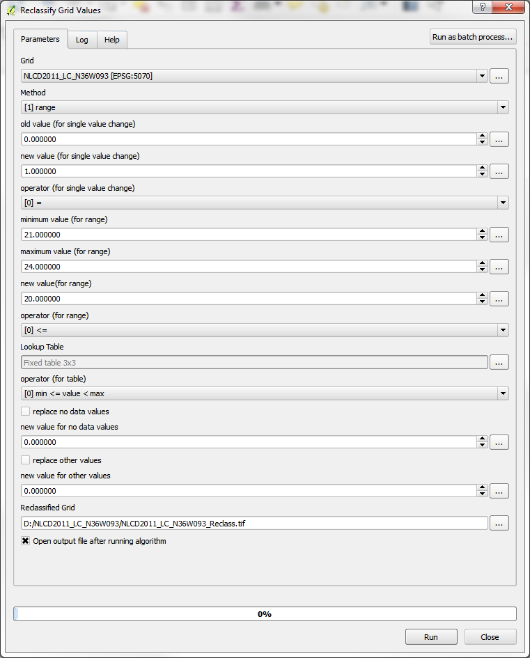
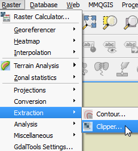
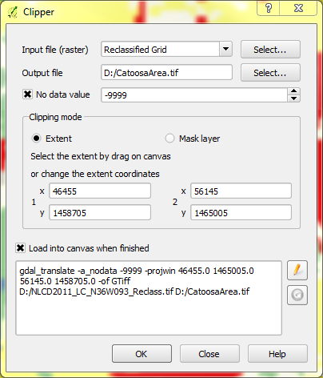
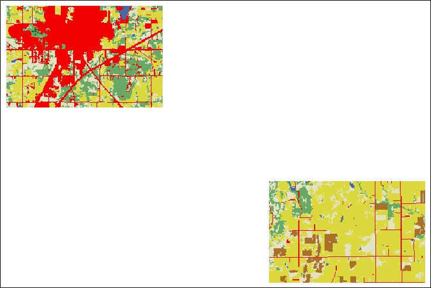
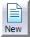
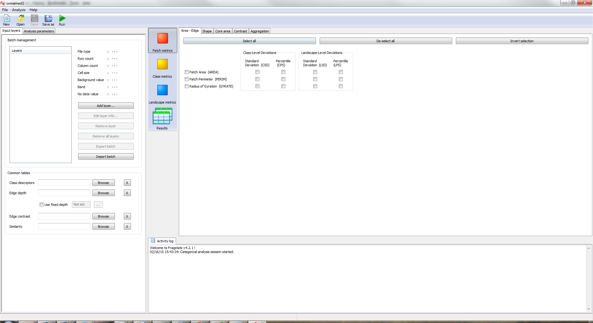
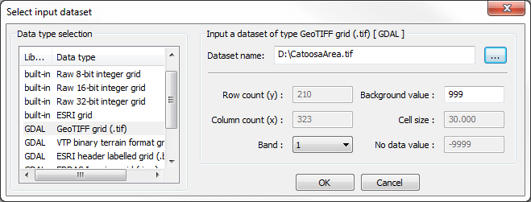
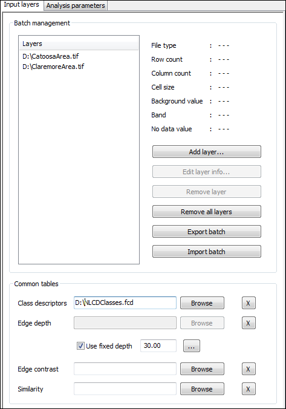
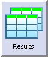

***Due Date: Tuesday, 1 March 2016***


*There are 10 questions for Part 1 (below) and additional questions for Part 2 will be provided on Tuesday. This lab will be worth 20 points total (with one point per question, across both Part 1 and Part 2). All answers are due on the date specified above. PLEASE WRITE YOUR NAME ON ALL WORK*


#Part 1: Analyzing Categorical Rasters using FRAGSTATS

###Part 1 Questions - Answer the following questions as you go through this lab. Feel free to use any materials from lecture, the internet, and FRAGSTATS documentation. Be sure to include your name with your answers. Unless otherwise noted, use the 8 cell rule for defining patches.

1) Before running any formal analysis in FRAGSTATS, look at the landscapes for Catoosa and Claremore.

    a) Which do you think has a higher value for Contagion? Justify your answer.
    b) Which do you think has higher Shannon's Evenness? Justify your answer
  
2) In each landscape, which land cover class do you expect has the largest Related Circumscribing Circle (CIRCLE)? Why?

For the next questions run FRAGSTATS for Catoosa and Claremore with the 8 cell patch rule. You can simply chose all analyses of interest (look through the questions, identify the analyses you need with the the 8 cell rule, check the appropriate boxes in FRAGSTATS, and Run the program).

3)
    a) which landscape actually does have a higher contagion value? (What are the values?)
    b) which landscape has a higher Shannon's Evenness values? (What are the values?)

4) In the Claremore landscape, which land cover class has the highest mean radius of gyration? (Use the Class metrics -> Area-Edge tab -> Radius of Gyration. Does the answer differ when considering the weighted mean vs the non-weighted mean?

5) What land cover class has the highest average (*not weighted average*) Fractal Dimension Index (FRAC) in each landscape?

6) In each landscape, what is the land cover type of the patch with the largest value for Related Circumscribing Circle(CIRCLE)?  (You can import the results into R and use the 'order' function - see this website for help [http://www.statmethods.net/management/sorting.html](http://www.statmethods.net/management/sorting.html)).

7) For the Catoosa landscape and only the developed land cover, compute the average and area-weighted average Core Area of patches (a class metric) with the edge depth set to 30.

The next questions involve separate analyses from those listed above. It may be easiest to run individual analyses to answer for each question.

8) For the Catoosa landscape and only the developed land cover, compute the average and area-weighted average Core Area of patches (a class metric) with the edge depth set to 60. How does changing the edge depth affect these core area metrics? What causes this difference?


9) Carry out a moving window analysis of patch type richness for Catoosa (this is a landscape metric), with a square window and radius of 60; Present your result - it can simply be a screen-shot from QGIS if you want.
    a) What area appears to have the highest patch type richness? (e.g., Northwest, Northeast, Center?)
    b) What is the maximum richness found for the specified window size across the landscape?


10) Run FRAGSTATS for both Catoosa and Claremore using both the 8 cell patch rule and the 4 cell patch rule (you will need to run the analyses separately for the 8 cell and 4 cell rule). How many patches are identified in each of the landscapes based on each of those rules? (The Number of Patches calculation will be under Landscape Metrics - the Aggregation Tab - Subdivision section).


##Introduction

This assignment involves a few steps, which involve pre-processing of categorical raster datasets, and loading them into and analyzing them in [FRAGSTATS](http://www.umass.edu/landeco/research/fragstats/fragstats.html).  Though this exercise covers some basics of preparing data for, and analyzing them with FRAGSTATS, a more comprehensive tutorial is available from the program developers at [http://www.umass.edu/landeco/research/fragstats/downloads/fragstats_downloads.html#tutorials](http://www.umass.edu/landeco/research/fragstats/downloads/fragstats_downloads.html#tutorials). FRAGSTATS is available for download and installation on Windows computers at this link: [http://www.umass.edu/landeco/research/fragstats/downloads/fragstats_downloads.html#FRAGSTATS](http://www.umass.edu/landeco/research/fragstats/downloads/fragstats_downloads.html#FRAGSTATS). After downloading it, simply un-zip the folder, and run the .exe file.

We will use data from the [2011 National Land Cover Dataset (NLCD)](http://www.mrlc.gov/nlcd2011.php), for a couple of areas near Tulsa, OK. The NLCD is available at 30 meter resolution, for the entire United States; multiple layers are available for this, including categorical land cover data, percent canopy cover and percent impervious pavement per pixel. These data are available for download via both the [Multi-Resolution Land Characteristics Consortium (MRLC)](http://www.mrlc.gov/) and [The National Map Viewer and Download Platform](http://viewer.nationalmap.gov/basic/). You can store and work with these data in the directory of your choice.

For this lab, we will start with a 3 x 3 degree tile of the categorical NLCD layer for north-eastern Oklahoma, which includes part of Tulsa. This dataset is available through the University of Tulsa Harvey page, and can be downloaded, with full metadata by clicking [this link](../SampleData/NLCD2011_LC_N36W093.zip) (and it can  be downloaded from the sources listed above). Before we get into doing actual analyses, we will go through a few pre-processing steps, often necessary in setting up the types of analyses we will carry out. There are lots of different tools that can be used for these operations, but we'll use [QGIS](http://www.qgis.org) (version 2.12). We will use [R](http://cran.r-project.org/) to manage and process our results.

##Reclassify Raster
The 2011 NLCD has 20 specific potential land cover types, 15 of which occur in our focal tile. Each class is assigned a class number, as seen in the legend for this layer, available online at [http://www.mrlc.gov/nlcd11_leg.php](http://www.mrlc.gov/nlcd11_leg.php). If you use the 'inspect' tool of QGIS, you will see that each pixel has a numeric value, corresponding to legend in the previous link. The land cover classes are also grouped coarsely, as indicated by the 10s place of the ID number (e.g., all numbers in the 20s indicate varying levels of development).  Sometimes this scheme may not meet our needs perfectly. For example, in this lab we will consider all classes of development as the same. To deal with this, we will reclassify the raster, using a similar process as we used in the first lab of the semester.

Import the NLCD layer into QGIS as you would any other raster layer (use the 'NLCD2011_LC_N36W093.tif' file) - the resulting layer should look something like the image below. According to the metadata (available in an .html file that comes in the folder with this dataset), the data are in an Albers Equal Area projection; if you import some Google or Bing (or other)imagery and ensure that on the fly projection is enabled, that layer should appear in northeastern Oklahoma. The horizontal units for this projection layer are meters, which is important to know for later steps. You can also set the CRS for this layer to the standard EPSG code, 5070. (This won't change the projection, but will designate the corresponding EPSG code).

\


We will use SAGA, available form the Processing Toolbox to do the reclassification. In the processing toolbox, expand the SAGA menu, and find "Grid-Tools"; then, double click "Reclassify grid values". If the processing toolbox is not visible, click the "Processing" menu at the top of the QGIS screen, and click "Toolbox".  This may open in the "Simplified Interface", showing only a couple of tools - if this is the case, look to the bottom of the Processing Toolbox pane (typically appears on the right side) - there will be a drop-down menu where you can choose either "Advanced Interface" or "Simplified Interface" - choose the Advanced Interface.

In the window that pops up, you will designate the settings for this operation. These below settings will work for this lab - in the future, you can adjust these settings according to your own needs. After setting up all of the options, click 'Run'.

* Under 'Grid', chose the appropriate layer (NLCD2011_LC_N36W093).
* For 'Method', choose 'Range'.
* Set the minimum and maximum values for the range option as 21 and 24, respectively. This tells the operation that you want to reclassify values from 21 through 24 to a new value.
* For 'new value (for range)', set the value to 20, and leave the 'operator (for range)' set to the default ('[0]<=').
* Un-check the boxes for 'replace no data values' and 'replace other values'. This is important, as it will ensure other values in the layer will remain as they were originally.
* Designate a 'Reclassified grid' for your output file - saving it as a .tif file generally works well.

\

After this operation, your newly reclassified layer will appear in QGIS in gray-scale colors. In the list of layers in QGIS you can simply right click on the original NLCD, select 'Copy Style', and then right click on the new layer and select 'Paste Style' - this will apply the original color palette to this new layer.  Note, the areas classified as 'Developed', now designated as class 20, will appear black - that is because there was previously no class number 20 - you can go to the style settings (in the layer properties) and designate a color for class 20.


##Clipping Areas for Analysis
Now that we have the desired land cover classes established, we can on extract a couple of areas for analysis. Again, there are numerous ways to do this - what is shown here is probably among the simplest and easiest, though for this exercise, we will ignore bordering pixels along our focal areas. 

We will use the Raster Clipper tool in QGIS to extract two focal areas for this analysis: an area near Catoosa, OK that we have highlighted during lab, and a nearby area of Claremore, OK.  The corresponding extents will be as follows:

* **Catoosa Area** Lower Left: x = 46455, y = 1458705; Upper Right: x = 56145, y = 1465005
* **Claremore Area** Lower Left: x = 30075, y = 1469655; Upper Right: x = 39765, y = 1475955

For each area, go to the Raster menu at the top of the QGIS window, mouse over 'Extraction' and click 'Clipper'. 

\

In the window that opens, you can select the layer you want to clip (the reclassified NLCD layer), designate the output file, set the 'Clipping mode' to 'Extent', and fill in the coordinates. I typically set the 'No data value' to -9999, to avoid any confusion of my focal area includes locations without data. This is not the case for this area, but can be good practice. The image below is the setup for the Catoosa area; *you will also need to do this for the Claremore area (designated above)*.

\

The two areas are nearby, and your results should look like this: 

\


##Load Data Into FRAGSTATS
Now that we have a couple of landscapes to analyze, we can import them to FRAGSTATS.  Open FRAGSTATS on your computer - you should be able to find it in your Start Menu. When the program opens up, the screen will appear blank; click the 'New' icon at the top and the screen below should appear. \


\


Click the 'Add layer...' button. Then, chose the file type you will import (GeoTIFF grid for these data), and browse to your dataset. In this case we have no 'Background value', but if you wanted to consider one of your classes as a background, you could indicate that class number in that box.  The rest of the information should be filled in automatically.  For the Catoosa area, this window should look like the image below.

\


*Note the 'Cell Size' is identified as '30.00'. FRAGSTATS assumes this is in meters, and all area and perimeter calculations will be based on this cell size. This is correct, and can be confirmed via the metadata and checked by measuring pixels while zoomed in within QGIS. If your data are in projected coordinates (i.e., Lat/Long), it is wise to reproject to a meter-based coordinate system prior to analysis.*

You can import the NLCD for the Claremore area too.

For this lab, we will only import one other file - the 'Class Descriptors' file, 'NLCDClasses.fcd'.  You can download it from the Harvey website under Week 5-6 folder, or you can view it at [this link](../SampleData/NLCDClasses.fcd). If you are simply viewing this online, you can copy and paste it into a text file (e.g., with Notepad on Windows), and save it as 'NLCDClasses.fcd'. If you downloaded the file from Harvey, open it with Notepad and explore it - this file simply tells FRAGSTATS which names correspond to the numeric land cover codes. I set this up for you, with the land cover classes that might be in these areas (and with the Developed classes all categorized as a single class), but you can easily create a similar file or adjust this for your own purposes.

One last thing that we will set is the edge depth, required for computing Core Area metrics. We will set a fixed edge depth for all land cover classes; check the box for 'Use fixed edge depth', click the '...' icon, and for now set the value to 30. 

If you wanted to use different edge depths for different land cover classes, you could use a file, similar to the Class Descriptors file; similarly, you can use files to specify similarity and contrast between different classes. This is described in detail in the [tutorial material available from the FRAGSTATS developers](http://www.umass.edu/landeco/research/fragstats/downloads/fragstats_downloads.html#tutorials).

At this point the left portion of the screen, with the 'Input Layers' tab, should look similar to this: 

\


##Analysis in FRAGSTATS
Now that we have data imported to FRAGSTATS, we can get on to some analyses. In the pane on the left, use the tabs at the top switch to 'Analysis Parameters'.  There are lots of things to adjust. For now we will leave the box checked for 'Use 8 cell neighborhood rule'. We will also save the results - check the box for 'Automatically save results', and browse to designate a results file. I will name mine 'CatoosaClaremore1', and subsequent analyses can be named in a logical way of your choosing. There are various sampling strategies that can be chosen, in which only specified parts of the landscape are analyzed. We will leave the Sampling Strategy set to the default (No Sampling), and we will check the boxes for Patch Metrics, Class Metrics, Landscape Metrics, and Generate Patch ID file. You can browse through the Patch Metrics, Class Metrics, and Landscape Metrics tabs in the middle of the screen to see what analyses are available. We discussed many metrics in class, and you can read further about them in the FRAGSTATS Documentation.

Notice that a lot of metrics can be calculated at all of the three scales - Patch metrics apply to individual patches; Class metrics describe the arrangement of specific land cover types within the landscape; and Landscape metrics describe the relationship of all land cover types, and the arrangement of all types with respect to all other types. For patch characteristics, we selected he option to generate a 'Patch ID' file -  this is a raster, where each pixel is assigned a value that identified what patch number it is associated with.

After you have the analyses you wish to run selected, simply click the 'Run' icon at the top of the screen. The results can be accessed from within FRAGSTATS by clicking the 'Results' icon near the center of the screen. \

In the Analysis Parameters pane (on the left),  you can also select to carry out Moving Window Analyses. These create new rasters for each class and landscape metric selected (which can be imported into GIS software just like any other raster). For class metrics, it will create a separate result raster for each metric of each class, so be aware, the results can add up quickly.

##Viewing Results
As aforementioned, you can view FRAGSTATS results directly within the software. When you run analyses with the option to automatically save results, the results are directly saved to comma delimited files, albeit the extension (i.e., suffix for the file names) will read '.patch', '.class', or '.land', corresponding to results for patch, class, and landscape metrics. (The results can also be saved from Fragstats after completing a run from the results window, using the 'Save run as...' button.) These files can be opened in a text editor like Notepad, and they can be imported into R using the simple 'read.csv()' command as illustrated below.

```{r, eval=FALSE}
CatoosaClaremorePatches <- read.csv("CatoosaClaremore1.patch")
CatoosaClaremoreClass <- read.csv("CatoosaClaremore1.class")
CatoosaClaremoreLand <- read.csv("CatoosaClaremore1.land")
```

There is also  an R package available for download that aggregates landscape and class metrics into a single data frame for analysis. The package is available for download at [
http://www.umass.edu/landeco/research/fragstats/downloads/fragstats_downloads.html#Rfrag](
http://www.umass.edu/landeco/research/fragstats/downloads/fragstats_downloads.html#Rfrag
). 

To install the package in R, open R, and use the 'Packages' menu at the top of the screen to navigate to 'Install package(s) from local zip file' - then browse your computer to your download location and select the appropriate file (Rfrag_1.0.zip). Load the packages as you would any other:

```{r, eval=FALSE}
library(Rfrag)
```

There is currently only one function: 'frag.combine'. You can use the help for this function to see the specific arguments, and here is an example of its usage:

```{r, eval=FALSE}
example <- frag.combine(path='D:/',inland = 'CatoosaClaremore1.land',
    inclass = 'CatoosaClaremore1.class')
```  

You can compare this to the original files - the result of this function is a table where each row represents an individual landscape (in this case, Catoosa and Claremore landscapes), and columns represent the landscape metrics, followed by the metrics for each class. This can make it easy to compare characteristics of multiple landscapes by simply comparing entries for respective columns across multiple rows.