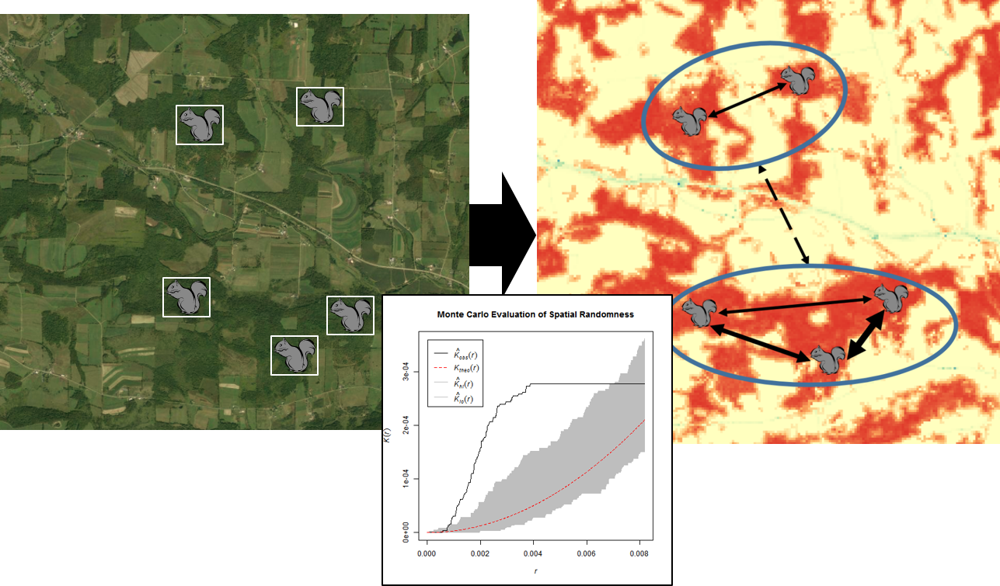

\pagenumbering{gobble}

\

**Course Description:**
Understanding spatial relationships among study organisms or sample units can provide critical insight into ecological and evolutionary patterns and processes. This class will focus on: 1) quantifying and controlling for spatial relationships in data; 2) using spatial interpolation techniques to estimate environmental variables at unmeasured points; and 3) modeling habitat and population connectivity across landscapes. 

The class will primarily focus on examples from ecology and evolutionary biology, but the techniques covered are applicable to other fields of study, and students will be encouraged to use their own data (or available datasets from their field of study) for assignments throughout the semester. 

*Extra time will be available on Thursdays to complete computer-based labs.*