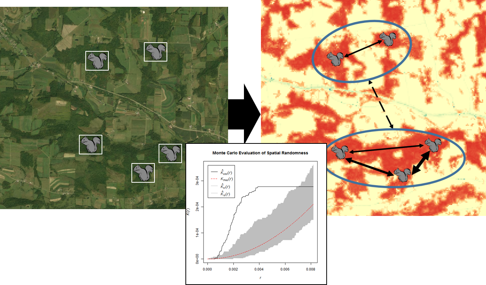

\pagenumbering{gobble}

\

**Course Description:**
Understanding spatial relationships among study organisms or sample units can provide critical insight into ecological and evolutionary patterns and processes. This class will focus on: 1) quantifying and controlling for spatial relationships in data; 2) using spatial interpolation techniques to estimate environmental variables at unmeasured points; and 3) modeling habitat and population connectivity across landscapes. Specific topics may be adjusted to match interests of enrolled students.

We will primarily work with examples from ecology and evolutionary biology, though the techniques to be covered are applicable to other fields of study. Students will be encouraged to use their own data (or available datasets from their field) for assignments throughout the semester. 

Contact the instructor with any questions at [mike-treglia@utulsa.edu](mailto:mike-treglia@utulsa.edu).

\* *Note: Extra time will be available on Thursdays to complete computer-based lab assignments.*
