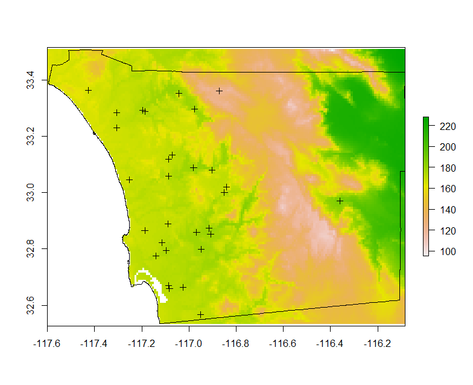
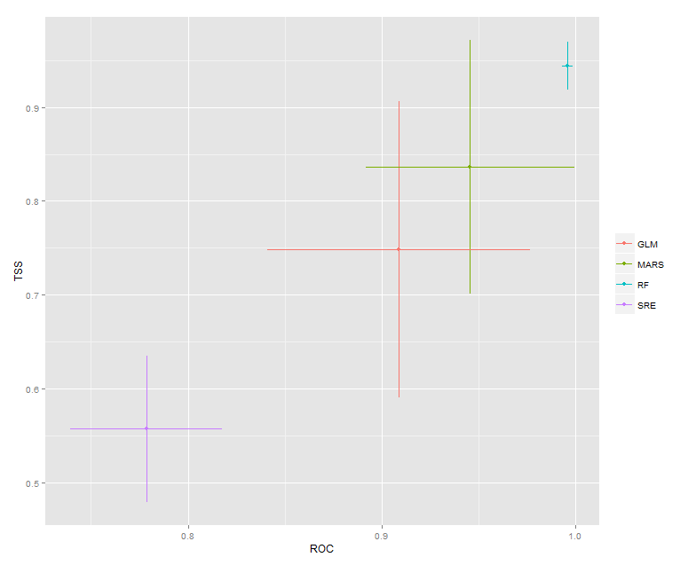
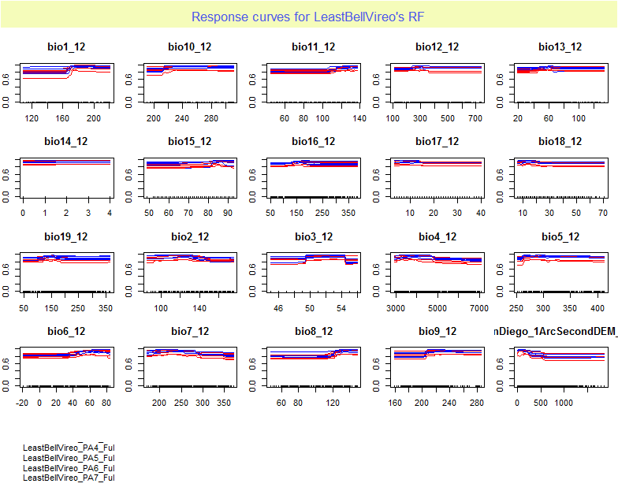
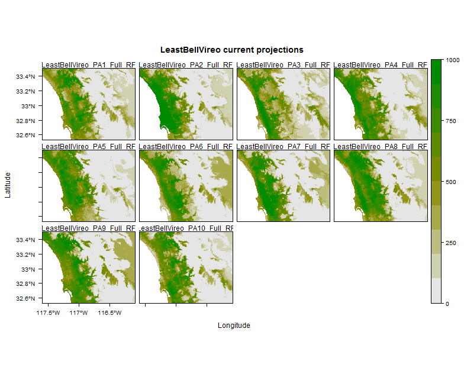

*This document, with active hyperlinks, is available online at:[https://github.com/mltConsEcol/TU_LandscapeAnalysis_Documents/blob/master/Assignments/Lab8_SpeciesDistributionModeling.Rmd](https://github.com/mltConsEcol/TU_LandscapeAnalysis_Documents/blob/master/Assignments/Lab8_SpeciesDistributionModeling.Rmd)*

***Questions Associated with this Lab will be given on Thursday (Due next Thursday, 2 April 2015); For now, just work through this material - look at the figures that are being created and think about what is going on.***


#Introduction

As discussed in lecture, species distribution modeling has broad applicability in ecology, evoluationary biology, and conservation biology. In this lab, we will work through a scenario where we need to identify potential habitats for an endangered songbird, Least Bell's Vireo (*Molothrus ater obscurus*), in San Diego County, California, USA. The species is heavily monitored in sites where it is known to exist. However, it may be possible to identify additional habitat or other populations in the area by developing species distribution models.

This lab involves not only developing the actual distribution models, but also pre-processing the data as you may need to do in your own projects for the class, or for your own research. Furthermore, these steps are useful to be familiar with in general.

R packages you will need for this lab are:

* raster
* rgdal
* biomod2

There are lots of other R packages available for species distribution modeling, and as you work on your individual projects for the class, we can look at packages that might be better or easier for using specific techinques.


```{r, include=FALSE}
library(raster)
library(biomod2)
library(rgdal)
```

#Data Sources
Most data necessary for species distribution models are publically available. Some datasets of endangered species may be somewhat restricted to prevent unwanted disturbance or collection, though collaboration with appropriate agencies can facilitate getting the necessary data. For this lab, I have made most datasets available for download via the Harvey webpage for the class, though you will need to download the species locality data for yourself.

##Species Locality Data
There is a variety of sources for locality data (i.e., species occurrences) - some are databases that often overlap in what is availalbe data, whereas others are unique. For example, locality information associated with specimens in natural history museums are largely available in VertNet [(http://vertnet.org/)](http://vertnet.org/) and the Global Biodiverity Information Facility(GBIF, [http://www.gbif.org/](http://www.gbif.org/)). However, the databases are not necessarily identical, and in your own work you should look into both of these sources. GBIF also has citizen science observations, collected and recorded, and verified through iNaturalist([http://www.inaturalist.org/(http://www.inaturalist.org/)]). Additional data may be availalbe from state and federal agencies (many agencies require collection localities to be reported in annual reports for scientific collecting permits). Other researchers may also have useful data, though their willingness to share may vary, and it can be worthwhile to forge collaborations as appropriate.

Though there are numerous sources for occurrence data, it can be difficult to acquire documented absence records, or points at which a species is verified not to occur for the focal time period of a study. While very beneficial in species distribution modeling, such datasets require intense surveys that take into account the probability of finding a species given it is present. Thus, researchers often collect their own field data, or develop collaborations with other scientists who have an established research program on the focal species, with appropriate survey work.

Given a lack of verifiable absence data, alternative such as 'pseudo-absences' are often used, in which points without locality records are used in place of absences. Various strategies are available for selecting pseudo-absence points, as discussed in lecture.

***For this lab we will focus on locality data for Least Bell's Vireo (*Molothrus ater obscurus*) from VertNet. Go to [http://vertnet.org/](http://vertnet.org/), and from the homepage search for data for this species - use the scientific name. It is often useful to put species names in quotes, to ensure the search only returns results for the species of interest. If you are aware of taxonomic synonyms for a species (i.e., multiple scientific names have been assigned to a species through time), you should check for synonyms. Since we are focusing this work on San Diego County, you can use the Search Options to specify that. Also check the box for "is mappable" to designate that you need only records with spatial coordinate information. Once you have the data available, click the appropriate link to downlaod it; the file will download as a tab-delimited text file (.txt).***


##Predictor Variables

Developing models of species distributions and making predictions of where habitat exists requires aquiring relevant environmental datasets for the focal study area. In this work, we will use Bioclimatic variables (described at [http://www.worldclim.org/bioclim](http://www.worldclim.org/bioclim)), and Elevation  variables from the [National Elevation Dataset](http://ned.usgs.gov/). Numerous other variables could be included, incorporating land cover attributes, and soil characteristics. However, we will only focus on the bioclimatic and topographic variables for now, as relatively static, long-term datasets that should generally be stable throughout the time period the locality data are from the 

The Bioclimatic layers are available from [http://worldclim.org/](http://worldclim.org/) - click the download tab on the home page, and select "Current" for the period from 1950-2000; project future and past climate data are also available. We will use the highest resolution data available (~1km) - at the top of the Download page, select the option to download the data by 'Tile' - this will take you to a map with a grid over it, where you can chose broad regions for which to download data.  Click on the box for "12", and links will appear on the bottom, for two different formats and a few different dataset options - select the "Bioclim" option under the list of GeoTIFFs.  This should initiate a download, and you will need to un-zip the folder into your prefered working directory.

For the elevation dataset, you can download the data via [The National Map Viewer](http://viewer.nationalmap.gov/viewer/). We are using the 1 arc-second dataset for our study area. To speed things up for the class, I have made these available via the Harvey webpage, as a single file.

##Study Area Boundary

It is typically useful to have everything bounded to our focal area, or in this case, the boundaries of San Diego County. State-wide county boundary datasets are available for download via The National Map Viewer, though simpler options are often available from other sources - sometimes it take a bit of searching around. A shapefile is available for download from the San Diego GIS webpage, [http://www.sangis.org/download/index.html](http://www.sangis.org/download/index.html). I have made it available for you via the Harvey webpage for the class.


#Data Processing

With all of the required data downloaded, we have some processing steps to do. 

* We should clip all environmental data layers to our focal area (San Diego County) - this will save a lot of memory.
* We should make sure all data layers are in the same projection (if they are not, we should re-project them).
* We need to make sure all rasters are of the same grain size.


##Import Vector Data into R

First, we will import the points for Least Bell's Vireo - this will be similar to as you have imported points of spatial data in the past. Make sure your working directory is set appropriately, and then we will use the 'read.table' function as shown below. This file had some unusual formatting, so I had to try some different things, and ended up with the code below. This should generally work for importing data from VertNet. We'll name the dataset in R 'bell'.

```{r, tidy=TRUE}
#Set working directory with 'setwd(...)'
bell <- read.table("M_ater_obscurus.txt", sep="\t", header=TRUE, fill=TRUE, quote="")
#Adjsut the file name to match what you named it
#sep = '\t' indicates the delimter is Tab
#fill=TRUE fills blank fields with NAs
#quote="" Excludes characters in quotes
```

What we really care about is the latitude and longitude of the points, and we onlyh want unique points. Thus, we can reduce the dataset as follows:

```{r, tidy=TRUE}
#Reduce the dataset to latitude and longitude
bell <- bell[,c("decimallongitude", "decimallatitude")] 
bell <- na.omit(bell) #Remove any values where latitude or longitude coordinates are NA
bell <- unique(bell) #Only keep unique values - removes duplicate rows
```

Now we need to convert this to something that R sees as a Spatial Object - since all we have is coordinates, with no additional data, a SpatialPoints object will work (SpatialPointsDataFrames have additional data associated with them, as we used with the Harvard Forest dataset). Since we'll be dealing with multiple datasets and may have to adjust projections, we will have to define the projection - the data are in latitude/longitude coordinates in the WGS84 datum, thus we will assign the projection using the 'proj4string' as shown below (the corresponding EPSG code is 4326).

```{r, tidy=TRUE}
bell.sp <- SpatialPoints(cbind(bell$decimallongitude, bell$decimallatitude))
proj4string(bell.sp) <- "+proj=longlat +datum=WGS84 +no_defs"
```

Next we will import the boundary of San Diego County. This is a shapefile, so we will use the 'readOGR' function. If you have the actual shapefile stored within a folder in your working directory, you will have to include that folder name before the file. We can check that the shapefile has a projection assigned to it by simply calling the 'proj4string' of the object.

```{r, tidy=TRUE, eval=FALSE}
#Import San Diego County boundary and look at the projection
sdbound<-readOGR("./County_Boundary/COUNTY_BOUNDARY.shp", layer="COUNTY_BOUNDARY")
proj4string(sdbound)
```

**Notice that the projection of the county boundary is different from that of the points for the species - thus, we will have to change them at some point to make sure things will line up in analyses. We'll get on to that a bit later.**

##Import Raster Data into R

Next, we will need to import the raster layers of environmental variables into R. The digital elevation model is somewhat simpler, as it is only one file - we have imported rasters in earlier labs - the simplest way is using the 'raster' function in the 'raster' package, and we can look at the projection associated with it as we did above:

```{r, tidy=TRUE, eval=FALSE}
dem <- raster("SanDiego_1ArcSecondDEM_NED.tif")
proj4string(dem)
```

Importing the Bioclimatic (bioclim) data seems like it might be bit more confusing. There is actually a handy trick we can use to import all of them at once, and put them into a 'raster stack'. First, we'll temporarily change the working directory to the folder with those layers. To change the working directory from a the current folder to a sub-folder, we only need to indicate the sub-folder name. Then, we'll use import all of the contained '.tif' files into a 'raster stack', using the 'stack' function.

```{r, tidy=TRUE, eval=FALSE}
setwd("Bioclim_Tile12")
bioclim <- stack(list.files(pattern="*.tif$", full.names=TRUE))
#the * symbol indicates any file name is okay, as long as it is followed by '.tif'
#the $ symbol means that there cannot be anything following the '.tif' - if you look at the layers in a GIS program, sometimes a '.tif.aux.xml' file will be created; the $ helps avoid errors when R tries to incorrectly open those as raster layers

#If you plot 'bioclim', it will show all layers
#proj4string works the same for a stack as it did for the single DEM raster
```


##Cropping/Clipping Layers to the Study Area

The DEM and Bioclim layers span much greater areas than the study area, and thus processing of them will take much more time and computer memory than is really necessary for this work. To do manipulations like this however, we need to make sure focal layers are in the same projection. As we previously saw, pre-projection a large raster can be computationally intensive in R; reprojection of vector data tends to be simpler. Thus, we will reproject the San Diego County boundary to the respective projections of the raster layers. Then, with smaller raster datsets, we can reproject everything into a single coordinate system.

***Note: If you need to calcualte Slope, Aspect, etc. from a Digital Elevation Model in your own work, it is ideal to do so using a projection in which the horizontal units are the same as the vertical units (i.e., if Elevation is in meters, use a meter-based coordinate system); after the calculations are done, you can consider changing to a different type of coordinate system.***


```{r, tidy=TRUE, eval=FALSE}
#Create copies of the San Diego Boundary, projected to the same projections as the DEM and Bioclim rasters, respectively
sdbound.dem <- spTransform(sdbound, crs(dem))
sdbound.bioclim <- spTransform(sdbound, crs(bioclim))


#Use the 'crop' function to crop the layers digital elevation model and stack of bioclim layers
dem.crop <- crop(dem, sdbound.dem)
bioclim.crop <- crop(bioclim, sdbound.bioclim)
```


##Lining up the Rasters and Creating a Single Stack of Predictor Variables

Now that both sets of environmental data (the elevation and Bioclim layers) are clipped to the county boundaries, we can project one to the other and assign them the same grain size. For the purpose of this lab we will reproject the DEM to match up with the Bioclim layers, although in your own work, you may wish to match everything up to the DEM, keeping that high resolution. (The higher the resolution/smaller the grain size, the more computationally intense modeling may be.)

When you are simply trying to line up one raster to the other, it is fairly simple using the 'projectRaster' function. With two rasters, as we have, the first argument is the layer that you want to reproject, and the second is the layer that you want the first to match up with, as illustrated below. 

```{r, tidy=TRUE, eval=FALSE}
dem.bioclim <- projectRaster(dem.crop, bioclim.crop)
```

Now that all of the predictor variables are matching up, we can join them into a single raster stack, which will be used in species distribution modeling analyses.

```{r, tidy=TRUE, eval=FALSE}
PredVars <- stack(bioclim.crop, dem.bioclim)
```

You can see the names of the layers using 'names(PredVars)' - the Bioclim layers are listed first, with the number following 'bio' indicating which bioclim layer it is (the 12 simply indicates it is from Tile 12); the 'SanDiego_1ArcSecondDEM_NED' is the elevation layer.

##Reprojecting and Clipping the Locality Data

We previously created a copy of the San Diego County boundary that is reprojected to the same coordinate system as the Bioclim data (sdbound.bioclim). However, we still need to reproject the locality data, to ensure that the points are actually analyzed in the locations they should be, over the environmental data layers.

```{r, tidy=TRUE, eval=FALSE}
bell.sp.bioclim <- spTransform(bell.sp, crs(PredVars))

#Now we can plot everything and make sure they line up:
plot(PredVars[[1]]) #Only plots the first layer from the stack of predictor variables
plot(bell.sp.bioclim, add=T) #plot the locality points
plot(sdbound.bioclim, add=T) #plot the San Diego County boundary.
```

\


#Running Species Distribution Models

The above steps for processing spatial data to prepare them for species distribution modeling are not trivial and can take some time, but it is important not to skip those steps - having locality data mis-aligned with environmental data can cause severe errors in your model results.

Next we'll get into developing some different models using the R package '[biomod2](http://cran.r-project.org/web/packages/biomod2/)'. It allows users to run lots of different models (e.g., Generalized Linear Models, Generalized Additive Models, Random Forests, etc.), all at once. This makes it fairly simple to run multiple models with the same dataset and evaluate which ones are performing the best. Fine-tuning of model options can be done for individual algorithms using the function 'BIOMOD_ModelingOptions'.

The first step is having biomod2 set up your data... you have done pre-processing up to this point, but now you can automatically create pseudo-absence points, indicating how many independent sets of pseudo-absence points you want to use. You can also use this step to indicate what data you want to use as training vs. testing. There are some limitations here (e.g., there is no function to allow pseudo-absences to be selected with the same density as occurence records), but it is still very helpful.

The function we'll to set up our data use is 'BIOMOD_FormatingData', to specify important details - the help for this function gives important details about decisions you can make in this step - it is worth looking into.

```{r, tidy=TRUE, eval=FALSE}
LeastBellVireo.ModelData <- BIOMOD_FormatingData(
  bell.sp.bioclim, 
  PredVars,
  resp.name="LeastBellVireo",
  PA.nb.rep=10, #10 different sets of pseudo-absence points created;
#models will be run once for each set of pseudo-absences
  PA.nb.absences=length(bell.sp.bioclim) #Set the number of pseudo-absence
#points equal to the number of presences (indicated by 'length(bell.sp.bioclim))
  )
```

Now we can actually run some models. Again, there are a lot of arguments that can be taken by the below function, 'BIOMOD_Modeling' - again, it is worth checking out the help for it. 

```{r, tidy=TRUE, eval=FALSE}
#We'll indicate that we want to use the default settings for all algorithms:
myBiomodOption <- BIOMOD_ModelingOptions()

#'models1' will be an object containing the output from the model runs
models1 <- BIOMOD_Modeling(LeastBellVireo.ModelData,
                models=c('GLM','RF', 'MARS','SRE'),
                #in the above line you can add other algorithms here
                #the more you sue the longer it will take
                model.options = myBiomodOption #indicate model options here         
                )
```

If you look at the structure of 'models1' now, you will see it contains a great deal of output. One of the resulting pieces of information is soem evaluation statistics. You can view the statistics for each model run using the following command:

```{r, tidy=TRUE, eval=FALSE}
get_evaluations(models1)
```

It will look somewhat messy, but these are the fit-statistics for each model type, with each set of pseudo-absences (PA1-10)

```{r, tidy=TRUE, eval=FALSE}
, , GLM, Full, PA1
      Testing.data Cutoff Sensitivity Specificity
KAPPA        0.592  563.0      74.194      84.848
TSS          0.590  563.0      74.194      84.848
ROC          0.875  570.5      74.194      87.879

, , RF, Full, PA1

      Testing.data Cutoff Sensitivity Specificity
KAPPA        0.969    532         100       96.97
TSS          0.970    532         100       96.97
ROC          0.998    535         100       96.97
```


The performance of the model runs can be visualized using the following code:

```{r, tidy=TRUE, eval=FALSE}
gg1 <- models_scores_graph(models1, by = 'models', metrics = c('ROC','TSS') )
```

The result will look something like the image below - the x-axis is the Area Under the Receiver Operating Curve (AUC; ranges 0.5-1.0; higher values are better). The y-axis is the True Skill Statistic, which ranges -1 to 1 (again, higher values are better). Thus, models with performance statistics closer to the top-right corner of the graph are performing better.  The bars around the central point for each model type give an indiciation of how much variation there was among model runs - Random Forests (RF) seems to have performed the best..

\


You can also view variable response curves (e.g., Partial Dependence Plots for machine learning techniques). Since Random Forests seemed to perform the best, lets look at those models:

```{r, tidy=TRUE, eval=FALSE}
#Change the algorithm you want to look at using 'models=' argument
models1.resp <- BIOMOD_LoadModels(models1, models='RF')

myRespPlot2D <- response.plot2(models = models1.resp,
                               Data = get_formal_data(models1,'expl.var'),
                               show.variables= get_formal_data(models1,'expl.var.names'),
                               do.bivariate = FALSE,
                               fixed.var.metric = 'median',
                               col = c("blue", "red"),
                               legend = TRUE,
                               data_species = get_formal_data(models1,'resp.var'))
```

\

We can also make projections of sites likely to be suitable for our focal species, based on the statistical models we developed with biomod2.

models1
```{r, tidy=TRUE, eval=FALSE}
#This first set of code does the projecting 
#(selected.models="all" does one projection for each model)
LeastBellVireo.projections <- BIOMOD_Projection(modeling.output = models1,
                                        new.env = PredVars, 
#If you wanted to predict to a different area, or different
#conditions you would change the above line
                                        proj.name = 'current',
                                        selected.models = "all" ,
                                        )

#Plot the predictions - adding the agrument 'str.grep="[model type]"' 
#lets you plot only results from specified model types
plot(LeastBellVireo.projections, str.grep="RF")
```

\


As much material as we've covered so far, there's even a lot more to species distribution modeling... the field is constantly expanding!


